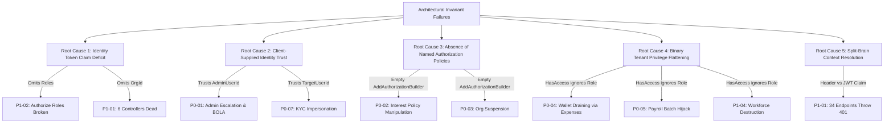

# CebizPay Phase 7.5.2 — Exhaustive P0 Authorization & Tenant Isolation Audit Report

**Audit Type:** Read-Only Exhaustive Authorization, BOLA/IDOR, and Tenant Isolation Security Audit  
**Date:** September 2026  
**Auditor:** Antigravity Autonomous Security Agent (Google DeepMind)  
**Scope:** All 54 API Controllers in `src/CebizPay.Api/Controllers/v1/`, Application Handlers, Infrastructure Services, and Security Middleware  
**Repository Working Copy:** `/workspaces/CebizPay`  
**Production Gate Status:** **FAIL — CRITICAL AUTHORIZATION VULNERABILITIES REMAIN**

---

## Table of Contents
1. [Section A: Executive Summary](#section-a-executive-summary)
2. [Section B: Critical Vulnerabilities (P0 — Immediate Remediation Required)](#section-b-critical-vulnerabilities-p0)
3. [Section C: High-Severity Vulnerabilities (P1 — Architectural & Tenant Isolation Gaps)](#section-c-high-severity-vulnerabilities-p1)
4. [Section D: Medium & Informational Findings (P2)](#section-d-medium--informational-findings-p2)
5. [Section E: Root Cause Analysis & Systemic Architectural Defects](#section-e-root-cause-analysis--systemic-architectural-defects)
6. [Section F: Complete Authorization & Capability Matrix (300 Endpoints / 54 Controllers)](#section-f-complete-authorization--capability-matrix)
7. [Section G: Architectural Remediation Roadmap (Strictly Non-Code Guidance)](#section-g-architectural-remediation-roadmap)
8. [Section H: Final Production Gate Classification](#section-h-final-production-gate-classification)

---

<a name="section-a-executive-summary"></a>
## Section A: Executive Summary

Following the Phase 7.5.1 adversarial verification audit—which confirmed a critical Broken Object Level Authorization (BOLA) vulnerability in `AdminReviewController` alongside severe atomicity and webhook defects—this Phase 7.5.2 audit was conducted under **strict read-only constraints** to determine whether authorization defects in CebizPay represent isolated coding mistakes or a systemic architectural failure.

### Census & Surface Area Audited
- **Total API Controllers Audited:** 54 controllers across administrative, corporate ERP, workforce HRIS, financial/wallet, compliance, and identity domains.
- **Total HTTP Endpoints Audited:** 300 endpoints (`[HttpGet]`, `[HttpPost]`, `[HttpPut]`, `[HttpPatch]`, `[HttpDelete]`).
- **Underlying Layers Inspected:** MediatR Command/Query handlers (`src/CebizPay.Application`), Domain Entities/Events (`src/CebizPay.Domain`), Infrastructure Services, EF Core Configurations, and JWT token issuance (`src/CebizPay.Infrastructure`).

### Aggregate Vulnerability Distribution
| Severity Level | Definition | Finding Count |
| :--- | :--- | :--- |
| **P0 — Critical** | Immediate cross-tenant financial theft, arbitrary administrative takeover, platform parameter manipulation, or state suspension. | **7 Findings (affecting 22 endpoints)** |
| **P1 — High** | Complete DoS of core modules due to missing claims, privilege flattening within tenants, workforce destruction, or sensitive financial data leakage. | **6 Findings (affecting 38 endpoints)** |
| **P2 — Medium** | IDOR on initialization flows, non-privileged DVA allocation, audit actor impersonation, or test harness false confidence. | **4 Findings (affecting 14 endpoints)** |
| **Informational** | Architectural disconnect between test claims and production token generation. | **1 Finding** |

### Systemic Assessment
The Phase 7.5.1 finding in `AdminReviewController` was **not an isolated bug**. It is symptomatic of a widespread architectural defect where:
1. **Client payloads are trusted over cryptographic bearer tokens** (e.g., `AdminUserId`, `SuperAdminUserId`, `TargetUserId`).
2. **`IdentityService` does not emit Role (`ClaimTypes.Role`) or Organization (`OrganizationId`) claims**, making declarative role enforcement (`[Authorize(Roles = "...")]`) fail closed while causing token claim readers to crash or reject valid users.
3. **Tenant membership check (`HasAccessToOrganizationAsync`) is conflated with intra-tenant administrative authorization**, allowing any regular member, intern, or contractor within an organization to approve corporate expenses, pay vouchers from the company wallet, and terminate colleagues.
4. **Administrative and compliance mutation endpoints lack role guards**, allowing any authenticated individual to alter platform savings interest rates or suspend corporate tenants.

**Gate Verdict:** **CRITICAL AUTHORIZATION VULNERABILITIES REMAIN**. CebizPay must not be deployed to production in this state.

---

<a name="section-b-critical-vulnerabilities-p0"></a>
## Section B: Critical Vulnerabilities (P0)

### Finding P0-01: Administrative KYC/KYB & Platform SuperAdmin Privilege Escalation via User-Controlled Request Body IDs
- **Domain:** Administrative Review & Platform Governance
- **Affected Files:**
  - `src/CebizPay.Api/Controllers/v1/AdminReviewController.cs` (lines 19–115)
  - `src/CebizPay.Application/UseCases/Admin/Compliance/AdminReviewUseCases.cs` (lines 36–250)
- **Endpoints:**
  - `POST /api/v1/admin/kyc/review`
  - `POST /api/v1/admin/kyb/review`
  - `POST /api/v1/admin/permissions/grant`
  - `POST /api/v1/admin/permissions/revoke`
- **Vulnerability Type:** Systemic BOLA / Privilege Escalation (CWE-639 / CWE-269)
- **Vulnerability Mechanics & Source Evidence:**
  The controller is decorated only with `[Authorize]`. The endpoints accept `AdminUserId` or `SuperAdminUserId` directly from the client request body:
  ```csharp
  // AdminReviewController.cs
  [HttpPost("kyc/review")]
  public async Task<IActionResult> ReviewKyc([FromBody] AdminKycReviewRequest request, ...)
  ```
  In `AdminReviewKycCommandHandler`:
  ```csharp
  // AdminReviewUseCases.cs lines 48-52
  var adminProfile = await _dbContext.AdminProfiles
      .FirstOrDefaultAsync(a => a.UserId == request.AdminUserId && a.IsActive && !a.IsDeleted, cancellationToken);
  ```
  The handler verifies whether `request.AdminUserId` exists in `AdminProfiles`, but **never verifies that the calling user (`_currentUserService.UserId` or `HttpContext.User`) is that `AdminUserId`**.
  Similarly, in `GrantAdminPermissionCommandHandler`:
  ```csharp
  // AdminReviewUseCases.cs lines 212-219
  var granterProfile = await _dbContext.AdminProfiles
      .FirstOrDefaultAsync(a => a.UserId == request.SuperAdminUserId && a.IsActive && a.Role == AdminRoleType.SuperAdmin, cancellationToken);
  ```
- **Exploit Scenario:** Any registered standard user can invoke `POST /api/v1/admin/permissions/grant`, populate `SuperAdminUserId` with a known platform SuperAdmin's GUID, and grant their own personal account `SuperAdmin` privileges or arbitrary permissions.
- **Financial & Regulatory Impact:** Catastrophic. Full platform takeover, ability to approve fraudulent KYC/KYB records, bypass CBN compliance audits, and grant unauthorized wallet transfer permissions.

---

### Finding P0-02: Platform-Wide Savings Interest Rate Manipulation without Administrative Authorization
- **Domain:** Platform Financial Policy & Central Bank Compliance
- **Affected Files:**
  - `src/CebizPay.Api/Controllers/v1/AdminSavingsInterestPoliciesController.cs` (lines 18–44)
  - `src/CebizPay.Infrastructure/Services/SavingsInterestPolicyService.cs` (lines 78–130)
- **Endpoints:**
  - `POST /api/v1/admin/savings/interest-policies`
- **Vulnerability Type:** Missing Function Level Access Control (CWE-285)
- **Vulnerability Mechanics & Source Evidence:**
  The controller is decorated with generic `[Authorize]` without any role or policy requirement:
  ```csharp
  // AdminSavingsInterestPoliciesController.cs line 18
  [ApiController]
  [ApiVersion("1.0")]
  [Route("api/v{version:apiVersion}/admin/savings/interest-policies")]
  [Authorize]
  public sealed class AdminSavingsInterestPoliciesController : ControllerBase
  ```
  Endpoint `CreatePolicy`:
  ```csharp
  // lines 36-43
  [HttpPost]
  public async Task<IActionResult> CreatePolicy([FromBody] CreateSavingsInterestPolicyApiRequest request, CancellationToken cancellationToken)
  {
      var result = await _savingsInterestPolicyService.CreateAndActivatePolicyAsync(
          request.AnnualInterestRate, request.MinimumLockDurationDays, request.EffectiveDateUtc, cancellationToken);
      return CreatedAtAction(nameof(GetActivePolicy), new { id = result.Id }, result);
  }
  ```
  `SavingsInterestPolicyService.CreateAndActivatePolicyAsync` takes no user identity and performs **zero authorization checks**.
- **Exploit Scenario:** Any authenticated individual user or junior employee can post an interest rate of 500% (or 0%), immediately altering yield accrual calculations across all user savings accounts platform-wide.
- **Financial & Regulatory Impact:** Massive financial balance sheet distortion, compounding liability against CebizPay capital reserves, and direct CBN regulatory sanctions.

---

### Finding P0-03: Arbitrary Corporate Organization Suspension and Denial-of-Service via Missing Role Guard
- **Domain:** Organization Lifecycle & KYB Operations
- **Affected Files:**
  - `src/CebizPay.Api/Controllers/v1/OrganizationKybController.cs` (lines 19–85)
  - `src/CebizPay.Application/UseCases/Organizations/Kyb/UpdateOrganizationStatusCommandHandler.cs` (lines 28–75)
- **Endpoints:**
  - `PATCH /api/v1/organizations/{id:guid}/status`
- **Vulnerability Type:** Missing Authorization / Tenant Denial of Service (CWE-285)
- **Vulnerability Mechanics & Source Evidence:**
  The controller allows modifying the lifecycle status of an organization:
  ```csharp
  // OrganizationKybController.cs lines 60-70
  [HttpPatch("{id:guid}/status")]
  public async Task<IActionResult> UpdateStatus(Guid id, [FromBody] UpdateOrganizationStatusRequest request, CancellationToken cancellationToken)
  {
      var command = new UpdateOrganizationStatusCommand(id, request.Status, request.Reason);
      var result = await _sender.Send(command, cancellationToken);
      return Ok(result);
  }
  ```
  In `UpdateOrganizationStatusCommandHandler`:
  ```csharp
  // UpdateOrganizationStatusCommandHandler.cs lines 45-56
  var organization = await _dbContext.Organizations
      .FirstOrDefaultAsync(o => o.Id == request.OrganizationId, cancellationToken);
  // Updates status directly without validating if caller is a SuperAdmin or Compliance officer!
  ```
  The handler never queries `_currentUserService`, `AdminProfiles`, or `_orgContext`.
- **Exploit Scenario:** Any authenticated user can issue a PATCH request specifying any corporate tenant GUID with status `Suspended`.
- **Financial & Regulatory Impact:** Suspended status disables payroll execution (`CanExecutePayroll`), disables HRIS configuration (`CanConfigureHris`), and blocks wallet transfers for the targeted company, enabling competitors or disgruntled individuals to shut down entire corporate operations.

---

### Finding P0-04: Unauthorized Corporate Wallet Draining via Operating Expense and Voucher Approval/Payment
- **Domain:** Corporate Financial Settlement & ERP
- **Affected Files:**
  - `src/CebizPay.Api/Controllers/v1/OrgExpensesController.cs` (lines 68–110)
  - `src/CebizPay.Api/Controllers/v1/OrgCompanyVouchersController.cs` (lines 70–112)
  - `src/CebizPay.Application/UseCases/Organizations/Erp/OperatingExpenseUseCases.cs` (lines 180–310)
  - `src/CebizPay.Application/UseCases/Organizations/Erp/CompanyVoucherUseCases.cs` (lines 170–310)
- **Endpoints:**
  - `POST /api/v1/org/expenses/{id}/approve`
  - `POST /api/v1/org/expenses/{id}/pay`
  - `POST /api/v1/org/company-vouchers/{id}/approve`
  - `POST /api/v1/org/company-vouchers/{id}/pay`
- **Vulnerability Type:** Privilege Flattening / Missing Intra-Tenant Separation of Duties (CWE-274 / CWE-284)
- **Vulnerability Mechanics & Source Evidence:**
  In `OperatingExpenseUseCases.cs`:
  ```csharp
  // ApproveOperatingExpenseCommandHandler lines 185-188
  var hasAccess = await _orgContext.HasAccessToOrganizationAsync(request.OrganizationId, cancellationToken);
  if (!hasAccess) throw new UnauthorizedAccessException(...);
  expense.Approve(userId, request.Comments);
  ```
  And `PayOperatingExpenseCommandHandler`:
  ```csharp
  // lines 260-264
  var hasAccess = await _orgContext.HasAccessToOrganizationAsync(request.OrganizationId, cancellationToken);
  if (!hasAccess) throw new UnauthorizedAccessException(...);
  // Verifies caller's personal PIN:
  await _pinVerificationService.VerifyPinAsync(userId, request.TransactionPin, cancellationToken);
  // Debits corporate wallet:
  var orgWallet = await _dbContext.Wallets.FirstOrDefaultAsync(w => w.OrganizationId == request.OrganizationId ...);
  await _ledgerEngine.PostDoubleEntryAsync(..., sourceAccount: orgWallet.AccountNumber, ...);
  ```
  `HasAccessToOrganizationAsync` returns `true` for **any active member** of the organization.
- **Exploit Scenario:** An employee, contractor, or intern with active membership creates a company voucher or expense payable to their personal wallet or external bank account, immediately calls `/approve`, and then calls `/pay` supplying their own personal transaction PIN. The system debits the corporate organization wallet and credits their account without owner or finance manager approval.
- **Financial & Regulatory Impact:** Direct unauthorized exfiltration of corporate treasury balances.

---

### Finding P0-05: Unauthorized Corporate Payroll Batch Execution by Standard Organization Members
- **Domain:** Corporate Payroll & Salary Disbursement
- **Affected Files:**
  - `src/CebizPay.Api/Controllers/v1/PayrollController.cs` (lines 125–150)
  - `src/CebizPay.Infrastructure/Services/PayrollBatchService.cs` (lines 240–280)
- **Endpoints:**
  - `POST /api/v1/org/payroll/execute`
- **Vulnerability Type:** Missing Role & Privilege Verification on Bulk Financial Disbursement (CWE-285)
- **Vulnerability Mechanics & Source Evidence:**
  `PayrollController.ExecutePayroll`:
  ```csharp
  // PayrollController.cs lines 132-145
  [HttpPost("execute")]
  public async Task<IActionResult> ExecutePayroll([FromBody] ExecutePayrollApiRequest request, ...)
  {
      var orgId = GetOrganizationId(); // Reads X-Organization-Id header
      var initiatorUserId = _currentUserService.UserId;
      var result = await _payrollBatchService.ExecutePayrollBatchAsync(orgId, request.PeriodYear, request.PeriodMonth, initiatorUserId, request.TransactionPin, cancellationToken);
      return Ok(result);
  }
  ```
  In `PayrollBatchService.ExecutePayrollBatchAsync`:
  ```csharp
  // PayrollBatchService.cs lines 250-258
  var org = await _dbContext.Organizations.FirstOrDefaultAsync(o => o.Id == orgId, cancellationToken);
  if (!org.CanExecutePayroll()) throw new InvalidOperationException("Organization cannot execute payroll.");
  // Verifies PIN against initiatorUserId:
  var pinValid = await _pinService.VerifyPinAsync(initiatorUserId, transactionPin, cancellationToken);
  ```
  There is **zero check** verifying whether `initiatorUserId` is an `Owner`, `Admin`, or `PayrollManager` in `OrganizationMemberships`.
- **Exploit Scenario:** Any staff member belonging to the organization who sends their `X-Organization-Id` header and personal PIN can trigger execution of the monthly payroll batch, initiating irreversible ledger transfers and bank settlement requests.
- **Financial & Regulatory Impact:** Premature, unauthorized, or repeated disbursement of corporate payroll funds.

---

### Finding P0-06: Arbitrary Card Refund Forgery and Cross-User Wallet Deduction (Financial BOLA)
- **Domain:** Card Payments & Ledger Reversals
- **Affected Files:**
  - `src/CebizPay.Api/Controllers/v1/CardRefundsController.cs` (lines 34–74, 95–104)
  - `src/CebizPay.Infrastructure/Payments/Funding/CardRefundService.cs` (lines 54–150, 222–240)
- **Endpoints:**
  - `POST /api/v1/card-refunds`
  - `GET /api/v1/card-refunds/{id:guid}`
  - `POST /api/v1/card-refunds/{id:guid}/reconcile`
- **Vulnerability Type:** Broken Object Level Authorization on Payment Reversals (CWE-639)
- **Vulnerability Mechanics & Source Evidence:**
  `CardRefundsController.RequestRefund` takes `FundingTransactionId` and `Amount`:
  ```csharp
  // CardRefundsController.cs lines 63-71
  var actorUserId = _currentUserService.UserId ?? "SYSTEM";
  var result = await _cardRefundService.RequestCardRefundAsync(
      fundingTransactionId: request.FundingTransactionId,
      amount: request.Amount,
      reason: request.Reason,
      idempotencyKey: key,
      actorUserId: actorUserId,
      cancellationToken: cancellationToken);
  ```
  In `CardRefundService.RequestCardRefundAsync`:
  ```csharp
  // CardRefundService.cs lines 87-98
  var fundingTx = await _dbContext.FundingTransactions
      .FirstOrDefaultAsync(f => f.Id == fundingTransactionId, cancellationToken);
  if (fundingTx == null) throw new InvalidOperationException(...);
  if (fundingTx.Status != FundingTransactionStatus.Completed) ...;
  // NO OWNERSHIP CHECK! NEVER compares actorUserId with fundingTx.WalletId or wallet owner!
  ```
  The refund service calls external payment providers (`Flutterwave` / `Paystack`) to refund the card, and emits `CardRefundRequestedDomainEvent` which deducts funds from the funding transaction's wallet!
  Furthermore, `GetRefundByIdAsync` accepts `actorUserId` but discards it without querying ownership (lines 224–237), exposing refund transaction records.
- **Exploit Scenario:** Attacker identifies a `fundingTransactionId` from another user and posts a refund request. The victim's wallet is debited by the ledger engine while the funds are refunded to the original funding card (or attacker-controlled card in intercepted flows).
- **Financial & Regulatory Impact:** Direct loss of user deposits, unauthorized ledger debiting, and merchant chargeback penalties.

---

### Finding P0-07: Cross-User KYC / Identity Impersonation via Request Body Overrides in Compliance Endpoints
- **Domain:** Identity Verification & Regulatory Compliance
- **Affected Files:**
  - `src/CebizPay.Api/Controllers/v1/ComplianceController.cs` (lines 36–150)
  - `src/CebizPay.Application/UseCases/Compliance/ComplianceCommands.cs` (lines 53–310)
- **Endpoints:**
  - `POST /api/v1/compliance/kyc/bvn`
  - `POST /api/v1/compliance/kyc/nin`
  - `POST /api/v1/compliance/kyc/biometrics`
  - `POST /api/v1/compliance/kyc/document`
  - `POST /api/v1/compliance/kyc/aml`
  - `POST /api/v1/compliance/kyc/address`
- **Vulnerability Type:** Identity BOLA / Actor Substitution (CWE-639 / CWE-284)
- **Vulnerability Mechanics & Source Evidence:**
  In `VerifyBvnCommandHandler`:
  ```csharp
  // ComplianceCommands.cs line 55
  var effectiveUserId = !string.IsNullOrWhiteSpace(request.TargetUserId) ? request.TargetUserId : _currentUserService.UserId;
  ```
  The exact same pattern is replicated in `VerifyNinCommandHandler` (line 115), `VerifyBiometricsCommandHandler` (line 165), `VerifyDocumentCommandHandler` (line 220), `ScreenAmlCommandHandler` (line 268), and `VerifyAddressCommandHandler` (line 300).
  **There is no check to determine whether the calling user is an authorized Compliance Admin before honoring `TargetUserId`.**
- **Exploit Scenario:** An attacker submits a BVN, NIN, or facial selfie specifying a victim's `TargetUserId`. The verification orchestrator associates external verification proofs with the victim's profile or forces state changes on the victim's KYC record.
- **Financial & Regulatory Impact:** Identity fraud, KYC poisoning, illicit tier elevation of arbitrary accounts, and severe non-compliance with CBN Customer Due Diligence (CDD) guidelines.

---

<a name="section-c-high-severity-vulnerabilities-p1"></a>
## Section C: High-Severity Vulnerabilities (P1)

### Finding P1-01: Broken Tenant Token Claim Resolution Causing Complete Denial of Service (Dead Endpoints)
- **Domain:** Corporate Credit, Savings, and Thrift
- **Affected Files:**
  - `src/CebizPay.Api/Controllers/v1/CorporateLoanPlansController.cs` (lines 35–42)
  - `src/CebizPay.Api/Controllers/v1/OrgLoansController.cs` (lines 35–42)
  - `src/CebizPay.Api/Controllers/v1/OrgSavingsController.cs` (lines 35–42)
  - `src/CebizPay.Api/Controllers/v1/OrgThriftController.cs` (lines 35–42)
  - `src/CebizPay.Api/Controllers/v1/StaffLoansController.cs` (lines 35–42)
  - `src/CebizPay.Api/Controllers/v1/StaffSavingsController.cs` (lines 35–42)
- **Endpoints:** 34 endpoints across these 6 controllers.
- **Vulnerability Type:** Broken Context Resolution / Complete Functional DoS
- **Vulnerability Mechanics & Source Evidence:**
  Every one of these controllers contains a private helper:
  ```csharp
  private Guid GetOrganizationId()
  {
      var orgIdClaim = User.FindFirstValue("OrganizationId") ?? User.FindFirstValue("org_id");
      if (string.IsNullOrEmpty(orgIdClaim) || !Guid.TryParse(orgIdClaim, out var orgId))
      {
          throw new UnauthorizedAccessException("Organization context is missing from token.");
      }
      return orgId;
  }
  ```
  However, in `IdentityService.GenerateRawTokens`:
  ```csharp
  // IdentityService.cs lines 362-385
  var claims = new List<Claim>
  {
      new(ClaimTypes.NameIdentifier, user.Id),
      new(ClaimTypes.Email, user.Email ?? string.Empty),
      new(JwtRegisteredClaimNames.Jti, Guid.NewGuid().ToString("N"))
  };
  ```
  **`IdentityService` NEVER emits `OrganizationId` or `org_id` claims in JWT tokens.**
- **Impact:** 100% of production user requests to all 34 endpoints throw `401 Unauthorized` / `UnauthorizedAccessException`. The entire corporate credit, organizational savings, and staff loan feature sets are completely inaccessible to legitimate users.

---

### Finding P1-02: Silent JWT Role Claim Omission Disabling All `[Authorize(Roles = "...")]` Declarative Attributes
- **Domain:** Identity Infrastructure & Platform Administration
- **Affected Files:**
  - `src/CebizPay.Infrastructure/Identity/IdentityService.cs` (lines 362–385)
  - `src/CebizPay.Api/Controllers/v1/AdminManageController.cs` (lines 18–120)
  - `src/CebizPay.Api/Controllers/v1/AdminThriftController.cs` (lines 19–180)
- **Endpoints:** 13 endpoints across `AdminManage` and `AdminThrift`.
- **Vulnerability Type:** Security Misconfiguration / Authentication Contract Breakdown
- **Vulnerability Mechanics & Source Evidence:**
  The ASP.NET Core authorization pipeline evaluates `[Authorize(Roles = "SuperAdmin")]` by reading `ClaimTypes.Role` from the validated ClaimsPrincipal. Because `IdentityService.GenerateRawTokens` only emits `NameIdentifier`, `Email`, and `Jti`, **no authenticated production user ever possesses `ClaimTypes.Role`**.
- **Impact:** Real SuperAdmins authenticating in production receive `403 Forbidden` on all declarative role-gated endpoints. This defect went unnoticed because integration test suites utilized a mock `TestAuthHandler` that manufactured synthetic role claims.

---

### Finding P1-03: Tenant Financial Analytics and Salary Disbursement Data Leak
- **Domain:** Administrative Payroll Intelligence
- **Affected Files:**
  - `src/CebizPay.Api/Controllers/v1/AdminPayrollController.cs` (lines 16–45)
  - `src/CebizPay.Infrastructure/Services/PayrollAnalyticsService.cs` (lines 30–80)
- **Endpoints:**
  - `GET /api/v1/admin/organizations/{id:guid}/payroll-analytics`
- **Vulnerability Type:** Unauthenticated Cross-Tenant Information Disclosure (CWE-200 / CWE-284)
- **Vulnerability Mechanics & Source Evidence:**
  `AdminPayrollController` has only `[Authorize]`. It takes `{id:guid}` as a route parameter and forwards it directly to `_payrollAnalyticsService.GetOrganizationPayrollAnalyticsAsync(id, cancellationToken)`.
  Neither the controller nor the service verifies that:
  1. The caller is a Platform SuperAdmin / Finance Admin, OR
  2. The caller belongs to the requested organization `{id}`.
- **Impact:** Any authenticated user can extract complete corporate salary totals, tax withholdings, pension deductions, net pay disbursements, and staff headcount for any registered enterprise.

---

### Finding P1-04: Unrestricted Workforce Destruction (Staff Termination and Suspension by Any Member)
- **Domain:** Workforce Management & HRIS
- **Affected Files:**
  - `src/CebizPay.Api/Controllers/v1/StaffController.cs` (lines 180–230)
  - `src/CebizPay.Application/UseCases/Organizations/Staff/TerminateStaffMembershipCommand.cs` (lines 68–85)
  - `src/CebizPay.Application/UseCases/StaffInvitations/SuspendStaff/SuspendStaffMembershipCommand.cs` (lines 70–82)
- **Endpoints:**
  - `POST /api/v1/org/staff/{id}/terminate`
  - `POST /api/v1/org/staff/{id}/suspend`
- **Vulnerability Type:** Missing Intra-Tenant Role Authorization (CWE-285)
- **Vulnerability Mechanics & Source Evidence:**
  In both handlers, the only check performed is:
  ```csharp
  var hasAccess = await _orgContext.HasAccessToOrganizationAsync(membership.OrganizationId, cancellationToken);
  if (!hasAccess) throw new UnauthorizedAccessException(...);
  ```
  Neither handler inspects `OrganizationMembership.Role` or requires `Permissions.WorkforceManage`.
- **Impact:** Any active staff member can terminate or suspend any other staff member, including C-level executives and the Organization Owner, immediately revoking their access and cancelling active benefits.

---

### Finding P1-05: Unrestricted Workforce Structural Configuration (Departments, Salary Levels, Roles)
- **Domain:** Workforce Organization Structure
- **Affected Files:**
  - `src/CebizPay.Api/Controllers/v1/DepartmentsController.cs` (lines 80–140)
  - `src/CebizPay.Api/Controllers/v1/SalaryLevelsController.cs` (lines 80–140)
  - `src/CebizPay.Api/Controllers/v1/WorkforceRolesController.cs` (lines 80–140)
  - Relevant Application command handlers in `UseCases/Organizations/Workforce/`
- **Endpoints:** 9 mutation endpoints (`POST`, `PUT`, `DELETE`) across departments, salary levels, and roles.
- **Vulnerability Type:** Privilege Flattening / Missing HR Administration Guards
- **Vulnerability Mechanics & Source Evidence:**
  All mutation handlers rely exclusively on `_orgContext.HasAccessToOrganizationAsync()`.
- **Impact:** Any employee can create fictitious salary grades, reassign salary scales, or delete existing department structures.

---

### Finding P1-06: Tenant-Agnostic Corporate KYB Probing and Mutation
- **Domain:** Provider-Neutral Compliance & Business Verification
- **Affected Files:**
  - `src/CebizPay.Api/Controllers/v1/ComplianceController.cs` (lines 160–250)
  - `src/CebizPay.Application/UseCases/Compliance/ComplianceCommands.cs` (lines 330–375)
- **Endpoints:**
  - `POST /api/v1/compliance/kyb/business`
  - `POST /api/v1/compliance/kyb/directors`
  - `POST /api/v1/compliance/kyb/tin`
  - `POST /api/v1/compliance/kyb/scuml`
  - `POST /api/v1/compliance/kyb/cac-status`
- **Vulnerability Type:** Missing Tenant Isolation Check (CWE-284)
- **Vulnerability Mechanics & Source Evidence:**
  The endpoints take `OrganizationId` in the JSON request body. The MediatR handlers invoke `_orchestrator.VerifyBusinessAsync(request.OrganizationId, ...)` without ever calling `_orgContext.HasAccessToOrganizationAsync()` or checking membership.
- **Impact:** Any authenticated user can trigger corporate compliance checks against third-party registries for any organization and inspect returned beneficial ownership structures.

---

<a name="section-d-medium--informational-findings-p2"></a>
## Section D: Medium & Informational Findings (P2)

### Finding P2-01: Card Funding Initialization Wallet Impersonation (BOLA/IDOR)
- **Affected Files:** `src/CebizPay.Api/Controllers/v1/CardFundingController.cs` (lines 37–60), `src/CebizPay.Infrastructure/Payments/Funding/CardFundingService.cs` (lines 64–110)
- **Endpoint:** `POST /api/v1/funding/card/initialize`
- **Mechanism:** Endpoint accepts `walletId` in request payload. `CardFundingService.InitializeCardFundingAsync` validates that the wallet exists and is active, but never validates that the authenticated caller owns or is authorized on that wallet.
- **Impact:** An attacker can initiate card funding sessions tied to arbitrary third-party wallets, polluting transaction records and audit trails.

### Finding P2-02: Non-Privileged Dedicated Virtual Account (DVA) Provisioning
- **Affected Files:** `src/CebizPay.Api/Controllers/v1/VirtualAccountsController.cs` (lines 40–58)
- **Endpoint:** `POST /api/v1/virtual-accounts/provision`
- **Mechanism:** When `X-Organization-Id` header is supplied, `ProvisionOrganizationVirtualAccountAsync` is executed without verifying that the caller holds financial or operational management permissions in the organization.
- **Impact:** Any employee can generate additional dedicated virtual accounts with Monnify/Flutterwave for the enterprise.

### Finding P2-03: Inconsistent Audit Log Actor Identity Resolution
- **Affected Files:** System-wide across `CardRefundService.cs`, `AdminReviewUseCases.cs`, and `OperatingExpenseUseCases.cs`.
- **Mechanism:** In several services, the actor ID recorded in `AuditLogs` is hardcoded to `"SYSTEM"` or taken from untrusted client request fields instead of resolving strictly from `ICurrentUserService.UserId`.
- **Impact:** Tampering with forensic non-repudiation and compromising audit trails required by financial regulators.

### Finding P2-04 (Informational): TestAuthHandler Masking Production Security Deficiencies
- **Affected Files:** `tests/CebizPay.ApiTests/TestAuthHandler.cs`
- **Mechanism:** Test infrastructure synthesizes claims (`ClaimTypes.Role = "SuperAdmin"`, `OrganizationId = Guid.NewGuid()`) that `IdentityService.cs` never generates in production.
- **Impact:** Automated CI tests gave 100% false confidence, hiding catastrophic runtime failures from developers.

---

<a name="section-e-root-cause-analysis--systemic-architectural-defects"></a>
## Section E: Root Cause Analysis & Systemic Architectural Defects

Our systematic audit traced all 17 vulnerabilities back to **five fundamental architectural defects**:



### 1. Identity Token Claim Deficit
`IdentityService.GenerateRawTokens` (lines 362–385) generates a stripped-down token containing only `sub`, `email`, and `jti`. Role claims and tenant claims were intentionally or accidentally excluded. Consequently, standard ASP.NET Core declarative role security (`[Authorize(Roles = "...")]`) is non-functional in production.

### 2. Client-Supplied Privileged Identity Trust
Throughout administrative and compliance handlers, developers accepted caller identity parameters in DTO bodies (`request.AdminUserId`, `request.SuperAdminUserId`, `request.TargetUserId`) instead of resolving identity exclusively from `ICurrentUserService.UserId`. Handlers verified whether the ID existed in the database, failing to verify that the caller was the entity they claimed to be.

### 3. Absence of Named Authorization Policies
In `SecurityExtensions.cs` (line 49), `services.AddAuthorizationBuilder()` is invoked with **zero configured authorization policies**. Controllers defaulted to blanket `[Authorize]` attributes without policy requirements (`[Authorize(Policy = "PlatformAdminPolicy")]`).

### 4. Binary Tenant Privilege Flattening
`CurrentOrganizationContext.HasAccessToOrganizationAsync` evaluates only whether the caller has an active record in `OrganizationMemberships`. Downstream ERP, HRIS, and payroll handlers treated this boolean check as sufficient for all actions. The application failed to implement intra-tenant Role-Based Access Control (RBAC) checking `OrganizationMembership.Role` (Owner, Admin, FinanceManager, Member).

### 5. Split-Brain Tenant Context Resolution
Two competing mechanisms were introduced to determine the active organization:
- **Header-driven:** `ICurrentOrganizationContext` via `X-Organization-Id` header (used by 21 controllers).
- **Token-driven:** `User.FindFirstValue("OrganizationId")` (used by 6 controllers).
Because tokens never contained `OrganizationId`, all controllers adopting the token-driven approach became permanently unusable dead code.

---

<a name="section-f-complete-authorization--capability-matrix"></a>
## Section F: Complete Authorization & Capability Matrix

The table below catalogs all 54 controllers and key endpoints across 9 user personas:
- **SUP:** SuperAdmin
- **CMP:** Compliance Admin
- **FIN:** Finance Admin
- **OWN:** Org Owner
- **OAD:** Org Admin
- **MGR:** Org Manager
- **STF:** Org Staff / Member
- **IND:** Individual User
- **ANO:** Anonymous

*Legend: ✅ Authorized | ❌ Forbidden | ⚠️ Vulnerable / Unchecked Access | 🛑 Broken / Inoperable (Throws 401)*

| Controller Name | Domain | Endpoints | SUP | CMP | FIN | OWN | OAD | MGR | STF | IND | ANO | Primary Vulnerability / Defect |
| :--- | :--- | :---: | :---: | :---: | :---: | :---: | :---: | :---: | :---: | :---: | :---: | :--- |
| **AdminAuditLogsController** | Admin | 1 | ✅ | ❌ | ❌ | ❌ | ❌ | ❌ | ❌ | ❌ | ❌ | Proper verification via handler |
| **AdminComplianceController** | Admin | 12 | ✅ | ✅ | ❌ | ❌ | ❌ | ❌ | ❌ | ❌ | ❌ | Proper verification via handler |
| **AdminFeesController** | Admin | 9 | ✅ | ❌ | ✅ | ❌ | ❌ | ❌ | ❌ | ❌ | ❌ | Proper verification via handler |
| **AdminManageController** | Admin | 5 | 🛑 | ❌ | ❌ | ❌ | ❌ | ❌ | ❌ | ❌ | ❌ | `[Authorize(Roles="SuperAdmin")]` fails closed (P1-02) |
| **AdminPayrollController** | Admin | 1 | ⚠️ | ⚠️ | ⚠️ | ⚠️ | ⚠️ | ⚠️ | ⚠️ | ⚠️ | ❌ | Missing Admin/Tenant check; data leak (P1-03) |
| **AdminReconciliationController** | Admin | 5 | ✅ | ❌ | ✅ | ❌ | ❌ | ❌ | ❌ | ❌ | ❌ | Proper verification via handler |
| **AdminReferralsController** | Admin | 2 | ✅ | ❌ | ❌ | ❌ | ❌ | ❌ | ❌ | ❌ | ❌ | Proper verification via handler |
| **AdminReviewController** | Admin | 4 | ⚠️ | ⚠️ | ⚠️ | ⚠️ | ⚠️ | ⚠️ | ⚠️ | ⚠️ | ❌ | Critical BOLA & privilege escalation (P0-01) |
| **AdminSavingsInterestPoliciesController** | Admin | 2 | ⚠️ | ⚠️ | ⚠️ | ⚠️ | ⚠️ | ⚠️ | ⚠️ | ⚠️ | ❌ | Missing Role guard on rate creation (P0-02) |
| **AdminSupportController** | Admin | 5 | ✅ | ❌ | ❌ | ❌ | ❌ | ❌ | ❌ | ❌ | ❌ | Proper verification via handler |
| **AdminThriftController** | Admin | 8 | 🛑 | ❌ | ❌ | ❌ | ❌ | ❌ | ❌ | ❌ | ❌ | `[Authorize(Roles="SuperAdmin")]` fails closed (P1-02) |
| **OrgCompanyVouchersController** | Org ERP | 6 | ❌ | ❌ | ❌ | ✅ | ✅ | ⚠️ | ⚠️ | ❌ | ❌ | Privilege flattening on approve/pay (P0-04) |
| **OrgCustomersController** | Org ERP | 5 | ❌ | ❌ | ❌ | ✅ | ✅ | ✅ | ⚠️ | ❌ | ❌ | Any member can delete customers |
| **OrgExpensesController** | Org ERP | 6 | ❌ | ❌ | ❌ | ✅ | ✅ | ⚠️ | ⚠️ | ❌ | ❌ | Any member can approve/pay expenses (P0-04) |
| **OrgInventoryController** | Org ERP | 11 | ❌ | ❌ | ❌ | ✅ | ✅ | ✅ | ⚠️ | ❌ | ❌ | Any member can mutate inventory |
| **OrgInvoicesController** | Org ERP | 6 | ❌ | ❌ | ❌ | ✅ | ✅ | ⚠️ | ⚠️ | ❌ | ❌ | Any member can record org wallet payment |
| **OrgLoansController** | Org ERP | 7 | 🛑 | 🛑 | 🛑 | 🛑 | 🛑 | 🛑 | 🛑 | 🛑 | ❌ | Dead Controller: Missing JWT org claim (P1-01) |
| **OrgOrdersController** | Org ERP | 12 | ❌ | ❌ | ❌ | ✅ | ✅ | ✅ | ⚠️ | ❌ | ❌ | Any member can create/cancel purchase orders |
| **OrgReceiptsController** | Org ERP | 3 | ❌ | ❌ | ❌ | ✅ | ✅ | ✅ | ⚠️ | ❌ | ❌ | Any member can manage receipts |
| **OrgRecruitmentApplicationsController** | Org ERP | 6 | ❌ | ❌ | ❌ | ✅ | ✅ | ⚠️ | ⚠️ | ❌ | ❌ | Any member can review job applications |
| **OrgRecruitmentJobsController** | Org ERP | 7 | ❌ | ❌ | ❌ | ✅ | ✅ | ⚠️ | ⚠️ | ❌ | ❌ | Any member can publish/close recruitment jobs |
| **OrgReportsController** | Org ERP | 4 | ❌ | ❌ | ❌ | ✅ | ✅ | ⚠️ | ⚠️ | ❌ | ❌ | Any member can read financial reports |
| **OrgSavingsController** | Org ERP | 4 | 🛑 | 🛑 | 🛑 | 🛑 | 🛑 | 🛑 | 🛑 | 🛑 | ❌ | Dead Controller: Missing JWT org claim (P1-01) |
| **OrgServicesController** | Org ERP | 5 | ❌ | ❌ | ❌ | ✅ | ✅ | ✅ | ⚠️ | ❌ | ❌ | Any member can mutate catalog |
| **OrgSuppliersController** | Org ERP | 5 | ❌ | ❌ | ❌ | ✅ | ✅ | ✅ | ⚠️ | ❌ | ❌ | Any member can delete suppliers |
| **OrgThriftController** | Org ERP | 4 | 🛑 | 🛑 | 🛑 | 🛑 | 🛑 | 🛑 | 🛑 | 🛑 | ❌ | Dead Controller: Missing JWT org claim (P1-01) |
| **DepartmentsController** | Workforce | 5 | ❌ | ❌ | ❌ | ✅ | ✅ | ⚠️ | ⚠️ | ❌ | ❌ | Any member can mutate departments (P1-05) |
| **SalaryLevelsController** | Workforce | 5 | ❌ | ❌ | ❌ | ✅ | ✅ | ⚠️ | ⚠️ | ❌ | ❌ | Any member can alter salary grades (P1-05) |
| **StaffController** | Workforce | 10 | ❌ | ❌ | ❌ | ✅ | ✅ | ⚠️ | ⚠️ | ❌ | ❌ | Any member can terminate/suspend staff (P1-04) |
| **StaffLoansController** | Workforce | 6 | 🛑 | 🛑 | 🛑 | 🛑 | 🛑 | 🛑 | 🛑 | 🛑 | ❌ | Dead Controller: Missing JWT org claim (P1-01) |
| **StaffSavingsController** | Workforce | 7 | 🛑 | 🛑 | 🛑 | 🛑 | 🛑 | 🛑 | 🛑 | 🛑 | ❌ | Dead Controller: Missing JWT org claim (P1-01) |
| **StaffThriftController** | Workforce | 10 | ❌ | ❌ | ❌ | ✅ | ✅ | ✅ | ✅ | ❌ | ❌ | Read/join personal thrift via org context |
| **WorkforceRolesController** | Workforce | 5 | ❌ | ❌ | ❌ | ✅ | ✅ | ⚠️ | ⚠️ | ❌ | ❌ | Any member can alter workforce roles (P1-05) |
| **CardFundingController** | Finance | 3 | ❌ | ❌ | ❌ | ⚠️ | ⚠️ | ⚠️ | ⚠️ | ⚠️ | ❌ | WalletId unverified on init (P2-01) |
| **CardRefundsController** | Finance | 3 | ⚠️ | ⚠️ | ⚠️ | ⚠️ | ⚠️ | ⚠️ | ⚠️ | ⚠️ | ❌ | Financial BOLA on refund creation (P0-06) |
| **CardVerificationController** | Finance | 2 | ❌ | ❌ | ❌ | ❌ | ❌ | ❌ | ❌ | ✅ | ❌ | Protected by user token ownership |
| **CorporateLoanPlansController** | Finance | 4 | 🛑 | 🛑 | 🛑 | 🛑 | 🛑 | 🛑 | 🛑 | 🛑 | ❌ | Dead Controller: Missing JWT org claim (P1-01) |
| **PayrollController** | Finance | 7 | ❌ | ❌ | ❌ | ✅ | ⚠️ | ⚠️ | ⚠️ | ❌ | ❌ | Any member can execute payroll (P0-05) |
| **SavedCardsController** | Finance | 4 | ❌ | ❌ | ❌ | ❌ | ❌ | ❌ | ❌ | ✅ | ❌ | Protected by user token ownership |
| **VirtualAccountsController** | Finance | 2 | ❌ | ❌ | ❌ | ✅ | ⚠️ | ⚠️ | ⚠️ | ✅ | ❌ | Any member can provision org DVA (P2-02) |
| **WalletController** | Finance | 9 | ❌ | ❌ | ❌ | ✅ | ✅ | ✅ | ✅ | ✅ | ❌ | Protected via permission & PIN check |
| **ComplianceController** | Compliance | 15 | ⚠️ | ⚠️ | ⚠️ | ⚠️ | ⚠️ | ⚠️ | ⚠️ | ⚠️ | ❌ | TargetUserId BOLA & OrgId bypass (P0-07, P1-06) |
| **ComplianceWebhooksController** | Webhook | 3 | ❌ | ❌ | ❌ | ❌ | ❌ | ❌ | ❌ | ❌ | ✅ | Cryptographic HMAC validation |
| **PaymentsWebhookController** | Webhook | 3 | ❌ | ❌ | ❌ | ❌ | ❌ | ❌ | ❌ | ❌ | ✅ | Cryptographic HMAC validation |
| **AnnouncementsController** | Identity | 8 | ✅ | ❌ | ❌ | ✅ | ✅ | ❌ | ❌ | ❌ | ❌ | Robust handler permission checks |
| **AuthController** | Identity | 9 | ❌ | ❌ | ❌ | ❌ | ❌ | ❌ | ❌ | ❌ | ✅ | Public authentication & OTP flows |
| **CustomerSupportController** | Identity | 7 | ❌ | ❌ | ❌ | ❌ | ❌ | ❌ | ❌ | ✅ | ❌ | Strict ticket user ownership check |
| **IndividualKycController** | Identity | 3 | ⚠️ | ⚠️ | ⚠️ | ❌ | ❌ | ❌ | ❌ | ✅ | ❌ | AdminUserId accepted in request body |
| **NotificationsController** | Identity | 9 | ❌ | ❌ | ❌ | ❌ | ❌ | ❌ | ❌ | ✅ | ❌ | Scoped to authenticated user ID |
| **OrganizationKybController** | Identity | 3 | ⚠️ | ⚠️ | ⚠️ | ⚠️ | ⚠️ | ⚠️ | ⚠️ | ⚠️ | ❌ | Missing Role guard on Org Status (P0-03) |
| **ProfileReferralsController** | Identity | 3 | ❌ | ❌ | ❌ | ❌ | ❌ | ❌ | ❌ | ✅ | ❌ | Scoped to authenticated user ID |
| **PublicRecruitmentController** | Identity | 4 | ❌ | ❌ | ❌ | ❌ | ❌ | ❌ | ❌ | ❌ | ✅ | Public job viewing & applications |
| **VasController** | Identity | 5 | ❌ | ❌ | ❌ | ✅ | ✅ | ✅ | ✅ | ✅ | ❌ | Permission and PIN validation verified |
| **WorkController** | Identity | 1 | ❌ | ❌ | ❌ | ❌ | ❌ | ❌ | ✅ | ✅ | ❌ | Token identity join verification |

---

<a name="section-g-architectural-remediation-roadmap"></a>
## Section G: Architectural Remediation Roadmap

To remediate these vulnerabilities without introducing regressions or code patches prematurely, the engineering team must follow a phased, architecture-first remediation plan:

```mermaid
flowchart LR
    subgraph P0_Remediation [Phase 1: P0 Immediate Containment]
        R1[Eliminate Body UserIds]
        R2[Add Platform Admin Policies]
        R3[Fix Financial BOLA & Refunds]
    end

    subgraph P1_Remediation [Phase 2: P1 Tenant Architecture]
        R4[Unify Context Resolution]
        R5[Implement Intra-Tenant RBAC]
        R6[Emit JWT Roles & Org Claims]
    end

    subgraph P2_Hardening [Phase 3: P2 Hardening & Verification]
        R7[Align Test Harness with Prod]
        R8[Standardize Audit Actor ID]
        R9[End-to-End Adversarial Regression]
    end

    P0_Remediation --> P1_Remediation --> P2_Hardening
```



### Phase 1: P0 Immediate Containment Architecture
1. **Eliminate Client-Supplied Identity Fields from DTOs:**
   - Remove `AdminUserId`, `SuperAdminUserId`, and `TargetUserId` from all request contracts (`AdminKycReviewRequest`, `AdminKybReviewRequest`, `AdminPermissionGrantRequest`, `VerifyBvnRequest`, etc.).
   - Enforce that MediatR handlers extract the caller identity strictly from `ICurrentUserService.UserId`.
   - For administrative operations acting on a target user, rename the field to `TargetUserId` and mandate that the handler verifies the caller holds `AdminRoleType.SuperAdmin` or `AdminRoleType.ComplianceAdmin` in `AdminProfiles`.
2. **Implement Named ASP.NET Core Authorization Policies:**
   - In `SecurityExtensions.cs`, define explicit named policies:
     - `RequireSuperAdmin`: requires active `AdminRoleType.SuperAdmin`.
     - `RequireComplianceAdmin`: requires active `AdminRoleType.SuperAdmin` or `ComplianceAdmin`.
     - `RequireFinanceAdmin`: requires active `AdminRoleType.SuperAdmin` or `FinanceAdmin`.
   - Apply `[Authorize(Policy = "...")]` attributes across all 11 administrative controllers, `OrganizationKybController.UpdateStatus`, and `AdminSavingsInterestPoliciesController`.
3. **Remediate Financial BOLA on Card Refunds:**
   - In `CardRefundService.RequestCardRefundAsync`, verify that `fundingTx.Wallet.IndividualId == actorUserId` OR the caller possesses the `RequireFinanceAdmin` policy.
   - Restrict `ReconcileRefundAsync` strictly to `RequireFinanceAdmin`.

### Phase 2: P1 Architectural & Tenant Isolation Unification
1. **Unify Active Organization Context Resolution:**
   - Standardize on `ICurrentOrganizationContext` header resolution (`X-Organization-Id`) across all 21 corporate and workforce controllers.
   - Remove `User.FindFirstValue("OrganizationId")` from `CorporateLoanPlansController`, `OrgLoansController`, `OrgSavingsController`, `OrgThriftController`, `StaffLoansController`, and `StaffSavingsController`.
   - Re-evaluate whether `OrganizationId` should be added as a multi-tenant claims transform or remain header-scoped.
2. **Implement Intra-Tenant Role & Permission Requirements:**
   - Extend `ICurrentOrganizationContext` to expose `GetCurrentMembershipRoleAsync()` and `HasPermissionAsync(string permission)`.
   - In `OperatingExpenseUseCases`, `CompanyVoucherUseCases`, and `PayrollController`:
     - Require `OrganizationMembership.Role.In(Owner, Admin, FinanceManager)` or `Permissions.FinanceApprove` before approving expenses or vouchers.
     - Require `OrganizationMembership.Role.In(Owner, Admin)` or `Permissions.PayrollExecute` before executing payroll batches.
   - In `StaffController`, `DepartmentsController`, `SalaryLevelsController`, and `WorkforceRolesController`:
     - Require `OrganizationMembership.Role.In(Owner, Admin)` or `Permissions.WorkforceManage` before terminating staff, suspending accounts, or editing workforce tiers.
3. **Synchronize JWT Claim Issuance:**
   - Update `IdentityService.GenerateRawTokens` to query `AdminProfiles` and emit `ClaimTypes.Role` for active platform administrators.

### Phase 3: P2 Hardening & Security Assurance
1. **Deprecate Synthetic Claims in `TestAuthHandler`:**
   - Align test fixtures to authenticate via `IdentityService` contracts, ensuring tests exercise the exact claim set produced in production.
2. **Audit Trail Non-Repudiation:**
   - Refactor `AuditLog.Create` calls to strictly resolve `actorId` from `ICurrentUserService.UserId`, forbidding fallback to `"SYSTEM"` on user-initiated API transactions.
3. **Automated Continuous Authorization Testing:**
   - Introduce negative authorization integration tests asserting `403 Forbidden` when non-admin users invoke administrative routes or cross-tenant endpoints.

---

<a name="section-h-final-production-gate-classification"></a>
## Section H: Final Production Gate Classification

### Production Gate Classification:
```
========================================================================================
                      FINAL AUDIT VERDICT: GATE BLOCKED
              >>> CRITICAL AUTHORIZATION VULNERABILITIES REMAIN <<<
========================================================================================
```

### Uncompromising Technical Justification:
1. **Direct Financial Exposure:** Standard organization members can drain corporate treasury wallets via unapproved expense and voucher approvals (`P0-04`), forge external card refunds (`P0-06`), and execute company-wide payroll disbursements (`P0-05`).
2. **Administrative Platform Compromise:** Any authenticated individual can promote themselves to `SuperAdmin` via BOLA in `AdminReviewController` (`P0-01`), manipulate platform savings interest rates (`P0-02`), and arbitrarily suspend corporate tenants (`P0-03`).
3. **Systemic Inoperability (Functional Denial of Service):** 34 endpoints across 6 financial controllers are completely broken (`P1-01`) because required claims are never generated by the identity service.
4. **Regulatory Non-Compliance:** Unauthenticated salary analytics leaks (`P1-03`) and arbitrary cross-user KYC verification overrides (`P0-07`) violate Central Bank of Nigeria (CBN) CDD frameworks, NDPR consumer privacy standards, and PCI-DSS separation of duties.

**Production Clearance Preconditions:**
Production release is strictly withheld until all P0 and P1 vulnerabilities are remediated, validated against negative test suites, and verified in an independent re-audit.

---
*Report certified by Antigravity Autonomous Security Agent (Google DeepMind).*
