# CebizPay Frontend Implementation Plan — Phase 1 Blueprint

## 1. Executive Summary & Architectural Overview

This document presents the **Frontend Architecture Blueprint and Phased Implementation Plan** for the **CebizPay** fintech web platform.

The architecture directly incorporates the findings from:
1. Complete backend analysis of **48 controllers** and **264 API endpoints** in `src/CebizPay.Api`.
2. Authoritative design library indexing of **479 visual assets** in `frontend/design-library/`.
3. Strict technology and governance constraints established in the Phase 1 specification.

---

## 2. Technology Stack & Strict Constraints

| Technology / Library | Version / Specification | Rationale & Strict Constraints |
| :--- | :--- | :--- |
| **Framework** | **React 19 / 18** (via Vite) | High-performance SPA tooling, instant HMR, modern JSX runtime. |
| **Language** | **JavaScript (ES6+)** | **STRICT REQUIREMENT: NO TypeScript.** Zero `.ts` or `.tsx` files. |
| **Styling** | **Tailwind CSS v4** | CSS-first `@theme` configuration, zero boilerplate, pure design tokens. |
| **Routing** | **React Router (v6 / v7)** | Declarative nested routing, layout wrappers, route guards, error boundaries. |
| **Icons** | **Lucide React** (`lucide-react`) | Clean, outline stroke-based (1.5 - 2px), matches design library visual style. |
| **HTTP Client** | **Axios** | Interceptors for JWT auth, tenant headers, idempotency keys, and RFC 7807 error parsing. |
| **State Management** | **React Context API + Custom Hooks** | Lightweight, maintainable state management without heavyweight external state libraries. |
| **Mock Data Policy** | **Strictly NO Mock Data** | All business data originates from backend endpoints. Empty states and loading skeletons used for missing/loading states. |

---

## 3. Directory & Folder Architecture

The frontend application will reside under `frontend/` with the following clean modular layout:

```text
frontend/
├── public/
│   ├── favicon.ico
│   └── assets/
│
├── src/
│   ├── assets/                 # Static brand assets, SVGs
│   │   ├── logo.svg
│   │   └── illustrations/
│   │
│   ├── components/
│   │   ├── common/             # Reusable UI primitives
│   │   │   ├── Button.jsx      # Primary, secondary, outline, danger pill buttons
│   │   │   ├── Card.jsx        # Rounded-2xl white surface cards
│   │   │   ├── StatCard.jsx    # Metric counter cards with icon circles
│   │   │   ├── Badge.jsx       # Status pills & split metric badges
│   │   │   ├── Modal.jsx       # Centered dialog with backdrop blur
│   │   │   ├── Drawer.jsx      # Slide-over panel / mobile bottom sheet
│   │   │   └── Skeleton.jsx    # Pulsing shimmer loading placeholders
│   │   │
│   │   ├── forms/              # Form inputs & controls
│   │   │   ├── Input.jsx       # Rounded-xl text/number inputs
│   │   │   ├── SearchInput.jsx # Rounded-full search bar with icon
│   │   │   ├── Select.jsx      # Custom dropdown selector
│   │   │   ├── DatePicker.jsx  # Calendar popover input
│   │   │   ├── PinInput.jsx    # 4-digit transaction PIN input
│   │   │   └── FormError.jsx   # Inline field error message
│   │   │
│   │   ├── feedback/           # Notifications & alerts
│   │   │   ├── Toast.jsx       # Floating notification toast
│   │   │   ├── Alert.jsx       # Inline status alert banner
│   │   │   ├── SuccessModal.jsx# Post-action celebration dialog (done.png)
│   │   │   ├── ConfirmModal.jsx# Deletion / action confirmation (Delete Subject.png)
│   │   │   └── EmptyState.jsx  # Zero-data state with action CTA
│   │   │
│   │   ├── navigation/         # Navigation components
│   │   │   ├── Topbar.jsx      # Main topbar with user greeting & pill tabs
│   │   │   ├── Sidebar.jsx     # Deep module sidebar (Inventory / ERP / Admin)
│   │   │   ├── MobileNav.jsx   # Mobile drawer & bottom navigation
│   │   │   └── Breadcrumbs.jsx # Sub-page breadcrumb navigation
│   │   │
│   │   └── tables/             # Data grid components
│   │       ├── Table.jsx       # Standard striped/hover data table
│   │       ├── TableHeader.jsx # Column sorting & labels
│   │       ├── TableRow.jsx    # Interactive table row
│   │       ├── TableFilter.jsx # Multi-criteria filter popover (FILTER.png)
│   │       ├── TableExport.jsx # CSV/XLSX/PDF export dropdown (Download.png)
│   │       └── Pagination.jsx  # Bottom pagination controls (< [1] > of N)
│   │
│   ├── context/                # React Contexts
│   │   ├── AuthContext.jsx     # User session, JWT tokens, login/logout, roles
│   │   ├── OrgContext.jsx      # Active organization tenant context & switching
│   │   └── ToastContext.jsx    # Global notification queue & dispatcher
│   │
│   ├── hooks/                  # Custom React Hooks
│   │   ├── useAuth.js          # Access auth context & permissions
│   │   ├── useOrg.js           # Access active organization details
│   │   ├── useToast.js         # Dispatch success/error notifications
│   │   ├── useApiQuery.js      # Declarative data fetching hook with loading/error state
│   │   ├── useApiMutation.js   # Declarative mutation hook with idempotency support
│   │   └── useDebounce.js      # Input debouncing for search bars
│   │
│   ├── layouts/                # Route Layout Wrappers
│   │   ├── MarketingLayout.jsx # Public website & careers layout
│   │   ├── AuthLayout.jsx      # Centered auth container
│   │   ├── CustomerLayout.jsx  # Main application layout (Topbar + Content)
│   │   ├── ErpLayout.jsx       # Deep business layout (Topbar + Left Sidebar)
│   │   └── AdminLayout.jsx     # SuperAdmin & Compliance management layout
│   │
│   ├── pages/                  # Application Page Views
│   │   ├── public/             # Public web (Landing, Public Careers, Job Detail)
│   │   ├── auth/               # Login, Register Phone, Verify OTP, MFA, Redeem Invite
│   │   ├── customer/           # Customer & Organization Pages
│   │   │   ├── dashboard/      # Executive Dashboard
│   │   │   ├── wallet/         # Wallet Overview, Transfers, Funding, Cards
│   │   │   ├── vas/            # Airtime & Data Recharge
│   │   │   ├── payroll/        # Payroll Runs, History, Vouchers, Payslips
│   │   │   ├── staff/          # Staff Directory, Invitations, Departments, Roles, Salary Levels
│   │   │   ├── inventory/      # Items, Stock Movements, Valuation Policy
│   │   │   ├── sales/          # Sales Orders, Customers, Invoices, Receipts
│   │   │   ├── purchases/      # Purchase Orders, Suppliers, Expenses
│   │   │   ├── savings/        # Organization & Staff Savings
│   │   │   ├── thrift/         # Rotational Thrift Schemes (Ajo/Esusu)
│   │   │   ├── loans/          # Corporate Plans & Staff Loan Requests
│   │   │   ├── recruitment/    # Internal ATS & Job Vacancies
│   │   │   └── settings/       # Organization Profile, KYB, Security, Bank Accounts
│   │   │
│   │   └── admin/              # SuperAdmin Pages
│   │       ├── audit/          # Audit Logs Explorer
│   │       ├── compliance/     # KYC/KYB Screening & Approvals
│   │       ├── fees/           # Platform Fee Configurations
│   │       ├── reconciliation/ # Ledger Reconciliation & Disputes
│   │       └── users/          # Admin Staff & Role Management
│   │
│   ├── services/api/           # Modular API Service Layer
│   │   ├── client.js           # Configured Axios instance with interceptors
│   │   ├── authApi.js          # Authentication & user profile endpoints
│   │   ├── walletApi.js        # Transfers, funding, external accounts, cards
│   │   ├── vasApi.js           # Airtime, data bundles, operator detection
│   │   ├── payrollApi.js       # Payroll batches, vouchers, preview calculation
│   │   ├── staffApi.js         # Staff, departments, roles, salary levels
│   │   ├── inventoryApi.js     # Items, stock in/out, adjustments, valuation
│   │   ├── salesApi.js         # Invoices, orders, receipts, customers
│   │   ├── procurementApi.js   # Suppliers, purchases, expenses
│   │   ├── savingsApi.js       # Savings accounts, contributions, withdrawals
│   │   ├── thriftApi.js        # Thrift groups, positions, cycles
│   │   ├── loansApi.js         # Loan plans, staff applications
│   │   ├── complianceApi.js    # KYC submissions, KYB 2-step registration
│   │   └── adminApi.js         # Audit logs, compliance review, fees, reconciliation
│   │
│   ├── utils/                  # Helper Utilities
│   │   ├── currency.js         # Naira currency formatting (`₦238,000,909.00`)
│   │   ├── formatters.js       # Date/time formatting, phone number masks
│   │   ├── idempotency.js      # Unique UUID generation for financial mutations
│   │   ├── problemDetails.js   # RFC 7807 error parsing & message extraction
│   │   └── validators.js       # Client form validators (Email, Phone, RC Number, BVN)
│   │
│   ├── constants/              # Application Constants
│   │   ├── routes.js           # Centralized route paths
│   │   ├── permissions.js      # RBAC permission definitions
│   │   ├── banks.js            # Nigerian commercial bank codes
│   │   └── telcos.js           # Telecom operator identifiers & brands
│   │
│   ├── App.jsx                 # Route definitions & provider wrappers
│   ├── index.css               # Tailwind CSS v4 entrypoint & theme variables
│   └── main.jsx                # Application root mounting
│
├── package.json
└── vite.config.js
```

---

## 4. Experience Separation & Layout Architecture

The application cleanly separates user experiences into distinct layouts:

```mermaid
graph TD
    Root[App Router] --> GuestGuard[Guest Guard]
    Root --> AuthGuard[Auth Guard]
    Root --> AdminGuard[SuperAdmin Guard]

    GuestGuard --> MarketingLayout[MarketingLayout]
    MarketingLayout --> LandingPage[Landing / Careers]
    
    GuestGuard --> AuthLayout[AuthLayout]
    AuthLayout --> LoginPage[Login]
    AuthLayout --> RegisterPage[Phone Register & OTP]
    AuthLayout --> MfaPage[MFA Verification]
    AuthLayout --> InvitePage[Redeem Admin Invite]

    AuthGuard --> CustomerLayout[CustomerLayout: Topbar Nav]
    CustomerLayout --> Dashboard[Executive Dashboard]
    CustomerLayout --> Wallet[Wallet & Transfers]
    CustomerLayout --> Payroll[Corporate Payroll]
    CustomerLayout --> Staff[Staff & Workforce]

    AuthGuard --> ErpLayout[ErpLayout: Topbar + Sidebar]
    ErpLayout --> Inventory[Inventory & Stock]
    ErpLayout --> Sales[Sales Orders & Invoices]
    ErpLayout --> Procurement[Purchases & Suppliers]

    AdminGuard --> AdminLayout[AdminLayout: Admin Console]
    AdminLayout --> AuditLogs[Audit Logs]
    AdminLayout --> ComplianceReview[KYC / KYB Review]
    AdminLayout --> FeeManagement[Fee Schedules]
    AdminLayout --> Reconciliation[Ledger Reconciliation]
```



---

## 5. Centralized API Client & Security Configuration

### Axios Instance Setup (`services/api/client.js`)
- **Base URL**: `/api/v1`
- **Request Interceptor**:
  - Injects `Authorization: Bearer <token>` from active auth state.
  - Injects `X-Organization-Id: <orgId>` when operating in an organization context.
  - Generates and injects `Idempotency-Key: <uuid>` for POST/PUT financial mutations.
- **Response Interceptor**:
  - Automatically unwraps successful data payloads.
  - Intercepts RFC 7807 `application/problem+json` errors and converts them to standardized error objects.
  - Automatically dispatches global toast alerts for unhandled 500 errors or network failures.
  - Redirects to `/login` upon receiving 401 Unauthorized responses.

---

## 6. Phased Implementation Roadmap

The frontend implementation is organized into **13 structured, sequential milestones**:

```text
Phase 2.1: Project Scaffolding & Tailwind CSS v4 Setup
Phase 2.2: Design Tokens, CSS Variables & Common UI Atoms
Phase 2.3: API Client, RFC 7807 Parser & Idempotency Layer
Phase 2.4: Authentication, Phone OTP, MFA & Session State
Phase 2.5: Application Layouts & Topbar Pill Navigation
Phase 2.6: Executive Dashboard & Wallet Financial Balances
Phase 2.7: Wallet Transfers (P2P, Bank NIP) & Card Funding
Phase 2.8: Workforce HR, Staff Directory, Roles & Departments
Phase 2.9: Corporate Payroll Run & Payment Vouchers
Phase 2.10: ERP: Inventory, Catalog & Stock Movement
Phase 2.11: ERP: Invoices, Sales Orders, Purchases & CRM
Phase 2.12: Savings Schemes, Rotational Thrift (Ajo) & Loans
Phase 2.13: Admin Console, Compliance Review & Verification
```

---

## 7. Deliverable Verification Checklist

- [x] Backend inspected across all 48 controllers and 264 endpoints.
- [x] Design library catalogued across all 479 visual assets.
- [x] Design tokens (colors, typography, radii, shadows, spacing) formally documented.
- [x] Iconography strategy aligned with Lucide React and restrained aesthetic.
- [x] Responsive layout rules established for Desktop, Tablet, and Mobile.
- [x] API-to-UI mapping complete with zero mock data assumptions.
- [x] Centralized RFC 7807 ProblemDetails error-handling architecture specified.
- [x] Pure JavaScript constraint enforced (Zero TypeScript).
- [x] All 5 required documentation deliverables created and synchronized.

---

## 8. Status & Next Steps

**Phase 1 Analysis and Specification is 100% COMPLETE.**

All architectural plans, API inventories, design indexes, design system references, and mapping specifications are finalized in `docs/`.

Implementation will commence upon explicit approval and instruction to proceed to Phase 2.
