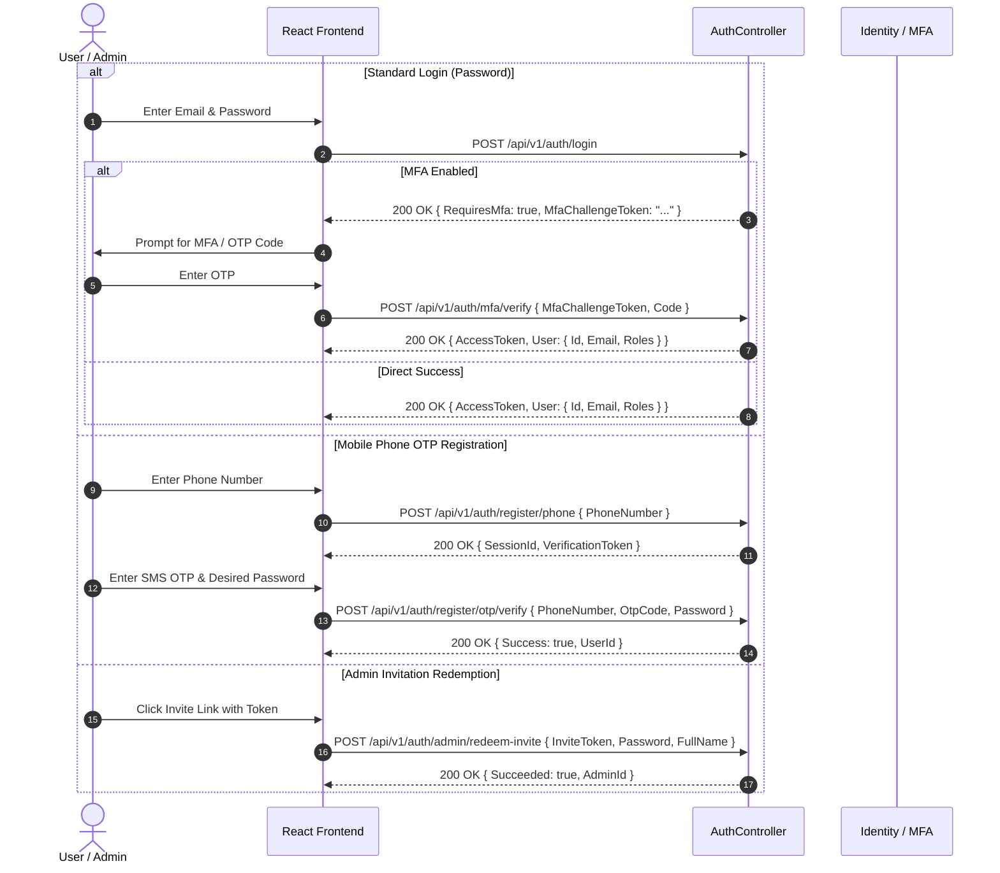

# CebizPay Frontend API Inventory

## 1. Executive Summary & API Surface Overview

This document provides a comprehensive, verified inventory of the entire CebizPay backend API surface (v1.0) for web frontend integration.

### Core Metrics
- **Total Controllers**: 48 Controllers in `src/CebizPay.Api/Controllers/v1/`
- **Total Available Endpoints**: 264 Endpoints
- **API Base Prefix**: `/api/v1`
- **Protocol & Serialization**: REST over HTTPS / JSON / RFC 7807 ProblemDetails for errors

### Endpoint Classification Breakdown
| Classification | Endpoint Count | Description & Target Web Layer |
| :--- | :--- | :--- |
| **Customer Web** | 208 | Authenticated business organization & retail customer features (Wallet, ERP, Payroll, Staff, Invoicing, Savings, Loans, Thrift, VAS, Cards) |
| **Admin Web** | 47 | Platform administrator & SuperAdmin management (Audit logs, Compliance review, Fee configuration, Reconciliation, Thrift oversight) |
| **Public Web** | 3 | Unauthenticated guest flows (Phone registration, User login, Public job vacancy application) |
| **Provider / Webhook** | 6 | External gateway and verification callbacks (Flutterwave, Paystack, Monnify, SmileID, Dojah, Ninja) |

---

## 2. Authentication & Authorization Architecture

### 2.1 JWT Bearer Authentication
- **Token Transport**: Standard HTTP `Authorization: Bearer <token>` header.
- **Clock Skew**: 5 seconds tolerance configured in `SecurityExtensions.cs`.
- **Validation**: Strict validation of Issuer, Audience, Lifetime, and Symmetric Signature Key.

### 2.2 Authentication & Verification Flows

### 2.3 Role-Based Access Control (RBAC) & Tenant Isolation
- **System Roles**: `SuperAdmin`, `ComplianceOfficer`, `FinanceAdmin`, `SupportAdmin`, `OrganizationOwner`, `OrganizationAdmin`, `Staff`, `Customer`.
- **Tenant Isolation**: Handled via `ICurrentOrganizationContext`. Endpoints under `/api/v1/org/...` enforce tenant boundary isolation via authenticated user claims and optional organization headers.
- **Transaction PIN Protection**: Financial operations (transfers, VAS purchases, card charges) require explicit PIN validation or idempotency keys (`Idempotency-Key` / `X-Idempotency-Key`).

---

## 3. Rate Limiting Policies

The backend enforces targeted ASP.NET Core rate limiting policies configured in `Program.cs`:

| Policy Name | Limit | Window | Queue Limit | Applied Endpoints |
| :--- | :--- | :--- | :--- | :--- |
| **AuthLoginPolicy** | 10 requests | 1 minute | 0 | `POST /api/v1/auth/login` |
| **OtpRequestPolicy** | 5 requests | 1 minute | 0 | `POST /api/v1/auth/register/phone` |
| **OtpVerificationPolicy** | 5 requests | 1 minute | 0 | `POST /api/v1/auth/register/otp/verify` |
| **MfaVerificationPolicy** | 5 requests | 1 minute | 0 | `POST /api/v1/auth/mfa/verify` |
| **AuthPolicy** | 10 requests | 1 minute | 0 | `POST /api/v1/auth/change-password`, `POST /api/v1/auth/mfa/toggle`, `POST /api/v1/auth/admin/redeem-invite` |
| **FinancialTransferPolicy**| 10 requests | 1 minute | 2 | `POST /api/v1/wallet/transfer/peer`, `POST /api/v1/wallet/transfer/bank` |
| **PinVerificationPolicy** | 5 requests | 1 minute | 0 | PIN validation / changes |
| **FixedPolicy** | 100 requests | 1 minute | 10 | General authenticated traffic |

---

## 4. Comprehensive Controller & Endpoint Inventory

### 4.1 AdminAuditLogsController (`AdminAuditLogsController.cs`)

**Summary**: Audit trail querying API endpoints. Supports platform-wide querying for SuperAdmins and tenant-scoped querying for Organization users.

**Base Route**: `//api/v1/admin/audit-logs`

| HTTP Verb | Route | Auth / Roles | Rate Limit | Description / Purpose | Key Parameters / Request Body |
| :--- | :--- | :--- | :--- | :--- | :--- |
| **GET** | `/api/v1/admin/audit-logs` | Auth Required | `Default` | Retrieves paginated audit log entries with optional multi-attribute filters. Requires Permissions.AuditView for platform-wide access or active organization context for tenant-scoped access. | `[FromQuery] DateTime? fromUtc, [FromQuery] DateTime? toUtc, [FromQuery] string? actorId, [FromQuery] string? action, [FromQuery] string? resourceType, [FromQuery] string? resourceId, [FromQuery] Guid? organizationId, [FromQuery] string? correlationId, [FromQuery] int pageNumber = 1, [FromQuery] int pageSize = 20, CancellationToken cancellationToken = default` |

### 4.2 AdminComplianceController (`AdminComplianceController.cs`)

**Summary**: Administrative compliance APIs for compliance officers and platform risk managers. Provides EDD case management, on-demand risk reassessment, tightly permissioned manual overrides, and account restrictions.

**Base Route**: `//api/v1/admin/compliance`

| HTTP Verb | Route | Auth / Roles | Rate Limit | Description / Purpose | Key Parameters / Request Body |
| :--- | :--- | :--- | :--- | :--- | :--- |
| **GET** | `/api/v1/admin/compliance/assessments/{subjectType}/{subjectId}` | Auth (`SuperAdmin,Admin,Auditor`) | `Default` | Retrieves current active risk assessment and explainable factor findings for an individual or organization. | `[FromRoute] RiskSubjectType subjectType, [FromRoute] string subjectId, [FromQuery] Guid? organizationId, CancellationToken cancellationToken` |
| **GET** | `/api/v1/admin/compliance/assessments/{subjectType}/{subjectId}/history` | Auth (`SuperAdmin,Admin,Auditor`) | `Default` | Retrieves full immutable risk assessment audit history for a subject. | `[FromRoute] RiskSubjectType subjectType, [FromRoute] string subjectId, CancellationToken cancellationToken` |
| **POST** | `/api/v1/admin/compliance/assessments/evaluate` | Auth (`SuperAdmin,Admin,Auditor`) | `Default` | Triggers an on-demand risk reassessment for an individual or organization. | `[FromBody] EvaluateRiskRequest request, CancellationToken cancellationToken` |
| **GET** | `/api/v1/admin/compliance/edd/cases` | Auth (`SuperAdmin,Admin,Auditor`) | `Default` | Queries Enhanced Due Diligence (EDD) cases with optional status/type filters. | `[FromQuery] EddStatus? status, [FromQuery] RiskSubjectType? subjectType, [FromQuery] Guid? organizationId, CancellationToken cancellationToken` |
| **GET** | `/api/v1/admin/compliance/edd/cases/{id:guid}` | Auth (`SuperAdmin,Admin,Auditor`) | `Default` | Retrieves details of an Enhanced Due Diligence (EDD) case. | `[FromRoute] Guid id, CancellationToken cancellationToken` |
| **POST** | `/api/v1/admin/compliance/edd/cases/{id:guid}/request-information` | Auth (`SuperAdmin,Admin,Auditor`) | `Default` | Requests additional documentation or information from a customer for an EDD case. | `[FromRoute] Guid id, [FromBody] AdminRequestEddInformationRequest request, CancellationToken cancellationToken` |
| **POST** | `/api/v1/admin/compliance/edd/cases/{id:guid}/assign` | Auth (`SuperAdmin,Admin,Auditor`) | `Default` | Assigns a compliance officer investigator to an EDD case. | `[FromRoute] Guid id, [FromBody] AssignEddReviewerRequest request, CancellationToken cancellationToken` |
| **POST** | `/api/v1/admin/compliance/edd/cases/{id:guid}/approve` | Auth (`SuperAdmin,Admin,Auditor`) | `Default` | Approves an Enhanced Due Diligence (EDD) case. Enforces Senior Management authorization where required by regulation. | `[FromRoute] Guid id, [FromBody] ApproveEddCaseRequest request, CancellationToken cancellationToken` |
| **POST** | `/api/v1/admin/compliance/edd/cases/{id:guid}/reject` | Auth (`SuperAdmin,Admin,Auditor`) | `Default` | Rejects an Enhanced Due Diligence (EDD) case with formal justification. | `[FromRoute] Guid id, [FromBody] RejectEddCaseRequest request, CancellationToken cancellationToken` |
| **POST** | `/api/v1/admin/compliance/decisions/override` | Auth (`SuperAdmin,Admin,Auditor`) | `Default` | Applies a tightly permissioned administrative manual override to a compliance decision. Non-negotiable regulatory safeguards (e.g. active sanctions match) cannot be bypassed. | `[FromBody] ApplyComplianceOverrideRequest request, CancellationToken cancellationToken` |
| **POST** | `/api/v1/admin/compliance/restrictions` | Auth (`SuperAdmin,Admin,Auditor`) | `Default` | Places an active operational or financial volume restriction on an account. | `[FromBody] PlaceRestrictionRequest request, CancellationToken cancellationToken` |
| **POST** | `/api/v1/admin/compliance/restrictions/{id:guid}/release` | Auth (`SuperAdmin,Admin,Auditor`) | `Default` | Releases an active compliance restriction with mandatory justification. | `[FromRoute] Guid id, [FromBody] ReleaseRestrictionRequest request, CancellationToken cancellationToken` |

### 4.3 AdminFeesController (`AdminFeesController.cs`)

**Summary**: Platform fee policy management endpoints. Only authorized Super Admin users may modify fee policies.

**Base Route**: `//api/v1/admin/fees`

| HTTP Verb | Route | Auth / Roles | Rate Limit | Description / Purpose | Key Parameters / Request Body |
| :--- | :--- | :--- | :--- | :--- | :--- |
| **GET** | `/api/v1/admin/fees/peer-transfer/active` | Auth Required | `Default` | Returns the currently active peer-transfer fee policy. | `CancellationToken cancellationToken` |
| **GET** | `/api/v1/admin/fees/peer-transfer` | Auth Required | `Default` | Returns all historical peer-transfer fee policies ordered by version descending. | `CancellationToken cancellationToken` |
| **POST** | `/api/v1/admin/fees/peer-transfer` | Auth Required | `Default` | Creates and activates a new peer-transfer fee policy. Deactivates the previous active policy. Super Admin only — authorization is enforced within the command handler. Every policy change is audit-logged. | `[FromBody] CreateFeePolicyRequest request, CancellationToken cancellationToken` |
| **GET** | `/api/v1/admin/fees/bank-transfer/active` | Auth Required | `Default` | Returns the currently active bank-transfer fee policy. | `CancellationToken cancellationToken` |
| **GET** | `/api/v1/admin/fees/bank-transfer` | Auth Required | `Default` | Returns all historical bank-transfer fee policies ordered by version descending. | `CancellationToken cancellationToken` |
| **POST** | `/api/v1/admin/fees/bank-transfer` | Auth Required | `Default` | Creates and activates a new bank-transfer fee policy. Deactivates the previous active policy. Super Admin only — authorization is enforced within the command handler. Every policy change is audit-logged. | `[FromBody] CreateBankTransferFeePolicyRequest request, CancellationToken cancellationToken` |
| **GET** | `/api/v1/admin/fees/platform/active` | Auth Required | `Default` | Returns the currently active platform fee policy for a specific operation type. | `[FromQuery] FeeOperationType operationType, CancellationToken cancellationToken` |
| **GET** | `/api/v1/admin/fees/platform` | Auth Required | `Default` | Returns all historical platform fee policies, optionally filtered by operation type, ordered by version descending. | `[FromQuery] FeeOperationType? operationType, CancellationToken cancellationToken` |
| **POST** | `/api/v1/admin/fees/platform` | Auth Required | `Default` | Creates and activates a new platform fee policy version. Automatically deactivates the prior version for that operation type. Super Admin only — authorization is enforced within the command handler. Every policy change is audit-logged. | `[FromBody] CreatePlatformFeePolicyRequest request, CancellationToken cancellationToken` |

### 4.4 AdminManageController (`AdminManageController.cs`)

**Summary**: Platform Administrative User Management Controller. Restricts mutating operations strictly to Super Admins, while enabling audit and directory inspection.

**Base Route**: `//api/v1/admin/manage`

| HTTP Verb | Route | Auth / Roles | Rate Limit | Description / Purpose | Key Parameters / Request Body |
| :--- | :--- | :--- | :--- | :--- | :--- |
| **GET** | `/api/v1/admin/manage` | Auth (`SuperAdmin,Admin,Auditor`) | `Default` | Retrieves a paginated directory of administrative users. Accessible to SuperAdmin, Admin, and Auditor roles. | `[FromQuery] AdminRoleType? role = null, [FromQuery] bool? isActive = null, [FromQuery] string? search = null, [FromQuery] int pageNumber = 1, [FromQuery] int pageSize = 20, CancellationToken cancellationToken = default` |
| **POST** | `/api/v1/admin/manage/invite` | Auth (`SuperAdmin`) | `Default` | Issues a single-use 24-hour invitation for a new administrative user. Restricted to active Super Admins. | `[FromBody] InviteAdminRequest request, CancellationToken cancellationToken = default` |
| **PATCH** | `/api/v1/admin/manage/toggle-status` | Auth (`SuperAdmin`) | `Default` | Toggles the active/inactive state of an administrative user profile. Restricted to active Super Admins. | `[FromBody] ToggleAdminStatusRequest request, CancellationToken cancellationToken = default` |
| **DELETE** | `/api/v1/admin/manage/{id:guid}` | Auth (`SuperAdmin`) | `Default` | Soft deletes / archives an administrative user profile. Restricted to active Super Admins. | `Guid id, CancellationToken cancellationToken = default` |
| **POST** | `/api/v1/admin/manage/redeem-invite` | Public | `Default` | Redeems an administrative invitation token and completes onboarding credentials. Unauthenticated endpoint for newly invited administrators. | `[FromBody] RedeemAdminInviteRequest request, CancellationToken cancellationToken = default` |

### 4.5 AdminPayrollController (`AdminPayrollController.cs`)

**Summary**: Super Admin read-only administrative payroll analytics endpoints.

**Base Route**: `//api/v1/admin/organizations/{id:guid}/payroll-analytics`

| HTTP Verb | Route | Auth / Roles | Rate Limit | Description / Purpose | Key Parameters / Request Body |
| :--- | :--- | :--- | :--- | :--- | :--- |
| **GET** | `/api/v1/admin/organizations/{id:guid}/payroll-analytics` | Auth Required | `Default` | Retrieves aggregated multi-currency payroll analytics for an organization. | `[FromRoute] Guid id, CancellationToken cancellationToken` |

### 4.6 AdminReconciliationController (`AdminReconciliationController.cs`)

**Summary**: Administrative APIs for managing financial and compliance reconciliation, status requeries, event reprocessing, and manual review dispositions without unrestricted financial bypasses.

**Base Route**: `//api/v1/admin/reconciliation`

| HTTP Verb | Route | Auth / Roles | Rate Limit | Description / Purpose | Key Parameters / Request Body |
| :--- | :--- | :--- | :--- | :--- | :--- |
| **GET** | `/api/v1/admin/reconciliation/records` | Auth (`SuperAdmin,Admin,Auditor`) | `Default` | Retrieves paginated reconciliation records with optional rail, provider, and status filters. | `[FromQuery] ReconciliationType? type, [FromQuery] ReconciliationStatus? status, [FromQuery] string? provider, [FromQuery] int pageNumber = 1, [FromQuery] int pageSize = 50, CancellationToken cancellationToken = default` |
| **GET** | `/api/v1/admin/reconciliation/recoveries` | Auth (`SuperAdmin,Admin,Auditor`) | `Default` | Retrieves paginated list of outstanding financial recoveries owed by account holders. | `[FromQuery] Guid? walletId, [FromQuery] RecoveryStatus? status, [FromQuery] int pageNumber = 1, [FromQuery] int pageSize = 50, CancellationToken cancellationToken = default` |
| **POST** | `/api/v1/admin/reconciliation/requery` | Auth (`SuperAdmin,Admin`) | `Default` | Triggers an on-demand external provider status requery for any transaction or verification reference. | `[FromBody] RequeryStatusRequest request, CancellationToken cancellationToken` |
| **POST** | `/api/v1/admin/reconciliation/events/{eventId:guid}/retry` | Auth (`SuperAdmin,Admin`) | `Default` | Retries processing of a failed or dead-lettered durable webhook event. | `[FromRoute] Guid eventId, [FromQuery] bool isCompliance = false, CancellationToken cancellationToken = default` |
| **POST** | `/api/v1/admin/reconciliation/records/{recordId:guid}/review` | Auth (`SuperAdmin,Admin`) | `Default` | Submits an authorized manual review disposition for an unresolved reconciliation record. | `[FromRoute] Guid recordId, [FromBody] SubmitReviewRequest request, CancellationToken cancellationToken` |

### 4.7 AdminReviewController (`AdminReviewController.cs`)

**Summary**: Admin review, compliance, and permission management endpoints.

**Base Route**: `//api/v1/admin`

| HTTP Verb | Route | Auth / Roles | Rate Limit | Description / Purpose | Key Parameters / Request Body |
| :--- | :--- | :--- | :--- | :--- | :--- |
| **POST** | `/api/v1/admin/kyc/review` | Auth Required | `Default` | Reviews and verifies/rejects an individual's KYC status. | `[FromBody] UpdateKycStatusCommand command, CancellationToken cancellationToken` |
| **POST** | `/api/v1/admin/kyb/review` | Auth Required | `Default` | Reviews and verifies/rejects an organization's KYB submission. | `[FromBody] ReviewKybCommand command, CancellationToken cancellationToken` |
| **POST** | `/api/v1/admin/permissions/grant` | Auth Required | `Default` | Grants a delegated permission to an admin profile (Super Admin only). | `[FromBody] GrantAdminPermissionCommand command, CancellationToken cancellationToken` |
| **POST** | `/api/v1/admin/permissions/revoke` | Auth Required | `Default` | Revokes a delegated permission from an admin profile (Super Admin only). | `[FromBody] RevokeAdminPermissionCommand command, CancellationToken cancellationToken` |

### 4.8 AdminSavingsInterestPoliciesController (`AdminSavingsInterestPoliciesController.cs`)

**Summary**: API controller for Super Admin configuration of platform savings interest policies and effective rates.

**Base Route**: `/api/v1/admin/savings/interest-policies`

| HTTP Verb | Route | Auth / Roles | Rate Limit | Description / Purpose | Key Parameters / Request Body |
| :--- | :--- | :--- | :--- | :--- | :--- |
| **GET** | `/api/v1/admin/savings/interest-policies` | Auth Required | `Default` | Lists all historical and active savings interest policies. | `CancellationToken cancellationToken` |
| **POST** | `/api/v1/admin/savings/interest-policies` | Auth Required | `Default` | Creates and activates a new interest policy version, atomically superseding prior versions. | `[FromBody] CreateSavingsInterestPolicyRequest request, CancellationToken cancellationToken` |

### 4.9 AdminThriftController (`AdminThriftController.cs`)

**Summary**: Platform Administrative Thrift Oversight Controller. Provides platform-level monitoring of rotational savings (Ajo / Esusu) groups, delinquency intervention, and dispute resolution.

**Base Route**: `//api/v1/admin/thrifts`

| HTTP Verb | Route | Auth / Roles | Rate Limit | Description / Purpose | Key Parameters / Request Body |
| :--- | :--- | :--- | :--- | :--- | :--- |
| **GET** | `/api/v1/admin/thrifts` | Auth (`SuperAdmin,Admin,Auditor`) | `Default` | Retrieves a paginated directory of all platform Thrift groups. Accessible to SuperAdmin, Admin, and Auditor roles. | `[FromQuery] ThriftStatus? status = null, [FromQuery] ThriftFrequency? frequency = null, [FromQuery] Currency? currency = null, [FromQuery] Guid? organizationId = null, [FromQuery] string? search = null, [FromQuery] int pageNumber = 1, [FromQuery] int pageSize = 20, CancellationToken cancellationToken = default` |
| **GET** | `/api/v1/admin/thrifts/{id:guid}` | Auth (`SuperAdmin,Admin,Auditor`) | `Default` | Retrieves full oversight details for a specific Thrift group, including members, cycles, and dispute history. Accessible to SuperAdmin, Admin, and Auditor roles. | `Guid id, CancellationToken cancellationToken = default` |
| **GET** | `/api/v1/admin/thrifts/delinquencies` | Auth (`SuperAdmin,Admin,Auditor`) | `Default` | Retrieves the platform-wide Thrift delinquency and overdue member oversight queue. Accessible to SuperAdmin, Admin, and Auditor roles. | `[FromQuery] string? search = null, [FromQuery] int pageNumber = 1, [FromQuery] int pageSize = 20, CancellationToken cancellationToken = default` |
| **POST** | `/api/v1/admin/thrifts/{id:guid}/pause` | Auth (`SuperAdmin`) | `Default` | Pauses an active or locked Thrift group for investigation or administrative intervention. Restricted to Super Admins. | `Guid id, [FromBody] PauseThriftGroupRequest request, CancellationToken cancellationToken = default` |
| **POST** | `/api/v1/admin/thrifts/{id:guid}/resume` | Auth (`SuperAdmin`) | `Default` | Resumes a previously paused Thrift group. Restricted to Super Admins. | `Guid id, CancellationToken cancellationToken = default` |
| **GET** | `/api/v1/admin/thrifts/disputes` | Auth (`SuperAdmin,Admin,Auditor`) | `Default` | Retrieves a paginated list of Thrift oversight disputes. Accessible to SuperAdmin, Admin, and Auditor roles. | `[FromQuery] ThriftDisputeStatus? status = null, [FromQuery] Guid? thriftGroupId = null, [FromQuery] int pageNumber = 1, [FromQuery] int pageSize = 20, CancellationToken cancellationToken = default` |
| **POST** | `/api/v1/admin/thrifts/disputes` | Auth Required | `Default` | Lodges a new Thrift dispute or oversight issue. Accessible to authenticated platform users and admins. | `[FromBody] CreateThriftDisputeRequest request, CancellationToken cancellationToken = default` |
| **POST** | `/api/v1/admin/thrifts/disputes/{id:guid}/resolve` | Auth (`SuperAdmin`) | `Default` | Resolves or dismisses a Thrift dispute with administrative findings. Restricted to Super Admins. | `Guid id, [FromBody] ResolveThriftDisputeRequest request, CancellationToken cancellationToken = default` |

### 4.10 AuthController (`AuthController.cs`)

**Summary**: Authentication endpoints protected by targeted ASP.NET Core rate limiting policies.

**Base Route**: `//api/v1/auth`

| HTTP Verb | Route | Auth / Roles | Rate Limit | Description / Purpose | Key Parameters / Request Body |
| :--- | :--- | :--- | :--- | :--- | :--- |
| **POST** | `/api/v1/auth/login` | Public | `AuthLoginPolicy` | Authenticates a user with email and password. Rate limited by AuthLoginPolicy. | `[FromBody] LoginCommand command, CancellationToken cancellationToken` |
| **POST** | `/api/v1/auth/mfa/verify` | Public | `MfaVerificationPolicy` | Verifies short-lived MFA challenge code to obtain JWT tokens. Rate limited by MfaVerificationPolicy. | `[FromBody] VerifyMfaCommand command, CancellationToken cancellationToken` |
| **POST** | `/api/v1/auth/mfa/toggle` | Auth Required | `AuthPolicy` | Enables or disables MFA for the authenticated user/admin profile. Rate limited by AuthPolicy. | `[FromBody] ToggleMfaCommand command, CancellationToken cancellationToken` |
| **POST** | `/api/v1/auth/register/phone` | Public | `OtpRequestPolicy` | Initiates phone registration via OTP. Rate limited by OtpRequestPolicy. | `[FromBody] RegisterPhoneCommand command, CancellationToken cancellationToken` |
| **POST** | `/api/v1/auth/register/otp/verify` | Public | `OtpVerificationPolicy` | Verifies mobile OTP and completes registration. Rate limited by OtpVerificationPolicy. | `[FromBody] VerifyOtpCommand command, CancellationToken cancellationToken` |
| **POST** | `/api/v1/auth/change-password` | Auth Required | `AuthPolicy` | Changes password for the authenticated user. Rate limited by AuthPolicy. | `[FromBody] ChangePasswordCommand command, CancellationToken cancellationToken` |
| **POST** | `/api/v1/auth/admin/redeem-invite` | Public | `AuthPolicy` | Redeems an administrative invitation token and initializes admin credentials. Rate limited by AuthPolicy. | `[FromBody] CebizPay.Application.UseCases.Admin.Manage.RedeemAdminInviteCommand command, CancellationToken cancellationToken` |

### 4.11 CardFundingController (`CardFundingController.cs`)

**Summary**: Card wallet funding initialization, recurring charging, and reconciliation endpoints.

**Base Route**: `//api/v1/funding/card`

| HTTP Verb | Route | Auth / Roles | Rate Limit | Description / Purpose | Key Parameters / Request Body |
| :--- | :--- | :--- | :--- | :--- | :--- |
| **POST** | `/api/v1/funding/card/initialize` | Auth Required | `Default` | Initializes a secure hosted card funding checkout session. | `[FromBody] InitializeCardFundingApiRequest request, CancellationToken cancellationToken` |
| **POST** | `/api/v1/funding/card/charge-saved` | Auth Required | `Default` | Charges a tokenized saved card directly for wallet funding. | `[FromBody] ChargeSavedCardApiRequest request, [FromHeader(Name = "X-Idempotency-Key"` |
| **POST** | `/api/v1/funding/card/{fundingTransactionId:guid}/reconcile` | Auth Required | `Default` | Reconciles the payment status of a card funding transaction against the provider gateway. | `[FromRoute] Guid fundingTransactionId, CancellationToken cancellationToken` |

### 4.12 CardRefundsController (`CardRefundsController.cs`)

**Summary**: Card refund management endpoints. Handles provider refund execution and central ledger reversals.

**Base Route**: `//api/v1/card-refunds`

| HTTP Verb | Route | Auth / Roles | Rate Limit | Description / Purpose | Key Parameters / Request Body |
| :--- | :--- | :--- | :--- | :--- | :--- |
| **POST** | `/api/v1/card-refunds` | Auth Required | `Default` | Requests a refund for a completed card funding transaction. | `[FromBody] RequestCardRefundApiRequest request, [FromHeader(Name = "X-Idempotency-Key"` |
| **GET** | `/api/v1/card-refunds/{id:guid}` | Auth Required | `Default` | Retrieves a specific card refund by ID. | `[FromRoute] Guid id, CancellationToken cancellationToken` |
| **POST** | `/api/v1/card-refunds/{id:guid}/reconcile` | Auth Required | `Default` | Reconciles or re-attempts ledger reversal for a card refund. | `[FromRoute] Guid id, CancellationToken cancellationToken` |

### 4.13 CardVerificationController (`CardVerificationController.cs`)

**Summary**: Zero-auth and micro-charge card verification endpoints. Used to verify card ownership and securely save card tokens.

**Base Route**: `//api/v1/card-verification`

| HTTP Verb | Route | Auth / Roles | Rate Limit | Description / Purpose | Key Parameters / Request Body |
| :--- | :--- | :--- | :--- | :--- | :--- |
| **POST** | `/api/v1/card-verification/initialize` | Auth Required | `Default` | Initializes a card verification session (zero-auth or nominal micro-charge). | `[FromBody] InitializeCardVerificationApiRequest request, CancellationToken cancellationToken` |
| **POST** | `/api/v1/card-verification/complete` | Auth Required | `Default` | Completes the card verification session and tokenizes the card. | `[FromBody] CompleteCardVerificationApiRequest request, CancellationToken cancellationToken` |

### 4.14 ComplianceController (`ComplianceController.cs`)

**Summary**: Provider-neutral compliance verification APIs for Individual KYC and Corporate KYB. In accordance with CBN Customer Due Diligence regulations, individual tiered KYC is separate from legal person KYB. External provider checks produce neutral evidence and do not automatically constitute final CebizPay compliance approval.

**Base Route**: `//api/v1/compliance`

| HTTP Verb | Route | Auth / Roles | Rate Limit | Description / Purpose | Key Parameters / Request Body |
| :--- | :--- | :--- | :--- | :--- | :--- |
| **POST** | `/api/v1/compliance/kyc/bvn` | Auth Required | `Default` | Verifies an individual's Bank Verification Number (BVN) against official NIBSS registry records. | `[FromBody] VerifyBvnRequest request, [FromHeader(Name = "Idempotency-Key"` |
| **POST** | `/api/v1/compliance/kyc/nin` | Auth Required | `Default` | Verifies an individual's National Identification Number (NIN) against official NIMC registry records. | `[FromBody] VerifyNinRequest request, [FromHeader(Name = "Idempotency-Key"` |
| **POST** | `/api/v1/compliance/kyc/biometrics` | Auth Required | `Default` | Performs biometric liveness detection and 1:1 facial matching against a reference ID photo. | `[FromBody] VerifyBiometricsRequest request, [FromHeader(Name = "Idempotency-Key"` |
| **POST** | `/api/v1/compliance/kyc/document` | Auth Required | `Default` | Performs OCR and authenticity validation for a government-issued identity document. | `[FromBody] VerifyDocumentRequest request, [FromHeader(Name = "Idempotency-Key"` |
| **POST** | `/api/v1/compliance/kyc/aml` | Auth Required | `Default` | Screens an individual or entity against global AML, PEP, and sanctions watchlists. | `[FromBody] ScreenAmlRequest request, [FromHeader(Name = "Idempotency-Key"` |
| **POST** | `/api/v1/compliance/kyb/business` | Auth Required | `Default` | Verifies corporate legal entity registration status with the Corporate Affairs Commission (CAC). | `[FromBody] VerifyBusinessRequest request, [FromHeader(Name = "Idempotency-Key"` |
| **POST** | `/api/v1/compliance/kyb/beneficial-owners` | Auth Required | `Default` | Queries verified corporate directors and ultimate beneficial owners (UBOs) for an organization. | `[FromBody] GetBeneficialOwnersRequest request, [FromHeader(Name = "Idempotency-Key"` |
| **GET** | `/api/v1/compliance/operations/{reference}` | Auth Required | `Default` | Retrieves a verification operation and its immutable evidence collection by internal reference. | `[FromRoute] string reference, CancellationToken cancellationToken` |
| **GET** | `/api/v1/compliance/evidence` | Auth Required | `Default` | Queries historical verification evidence records. | `[FromQuery] string? userId, [FromQuery] Guid? organizationId, [FromQuery] VerificationCapability? capability, [FromQuery] int pageNumber = 1, [FromQuery] int pageSize = 20, CancellationToken cancellationToken = default` |
| **GET** | `/api/v1/compliance/profile` | Auth Required | `Default` | Retrieves the caller's Customer Due Diligence (CDD) profile, KYC tier, active compliance decision, and active restrictions. | `[FromQuery] RiskSubjectType subjectType = RiskSubjectType.Individual, [FromQuery] string? subjectId = null, [FromQuery] Guid? organizationId = null, CancellationToken cancellationToken = default` |
| **GET** | `/api/v1/compliance/risk` | Auth Required | `Default` | Retrieves the caller's current risk assessment and explainable factor findings. | `[FromQuery] RiskSubjectType subjectType = RiskSubjectType.Individual, [FromQuery] string? subjectId = null, [FromQuery] Guid? organizationId = null, CancellationToken cancellationToken = default` |
| **GET** | `/api/v1/compliance/risk/history` | Auth Required | `Default` | Retrieves the caller's historical risk assessment log. | `[FromQuery] RiskSubjectType subjectType = RiskSubjectType.Individual, [FromQuery] string? subjectId = null, CancellationToken cancellationToken = default` |
| **GET** | `/api/v1/compliance/edd/{id:guid}` | Auth Required | `Default` | Retrieves details of an assigned Enhanced Due Diligence (EDD) case. | `[FromRoute] Guid id, CancellationToken cancellationToken` |
| **POST** | `/api/v1/compliance/edd/{id:guid}/submit` | Auth Required | `Default` | Submits requested documentation or narrative for an active Enhanced Due Diligence (EDD) case. | `[FromRoute] Guid id, [FromBody] SubmitEddInformationRequest request, CancellationToken cancellationToken` |
| **POST** | `/api/v1/compliance/eligibility/check` | Auth Required | `Default` | Evaluates transaction compliance eligibility before executing a financial operation (payout, transfer, funding). | `[FromBody] CheckEligibilityRequest request, CancellationToken cancellationToken` |

### 4.15 ComplianceWebhooksController (`ComplianceWebhooksController.cs`)

**Summary**: Inbound webhook ingestion endpoints for external KYC/KYB compliance providers. Authenticates cryptographic signatures, deduplicates deliveries, and processes callbacks asynchronously.

**Base Route**: `//api/v1/compliance/webhooks`

| HTTP Verb | Route | Auth / Roles | Rate Limit | Description / Purpose | Key Parameters / Request Body |
| :--- | :--- | :--- | :--- | :--- | :--- |
| **POST** | `/api/v1/compliance/webhooks/dojah` | Public | `Default` | Webhook ingestion endpoint for Dojah identity and business verification callbacks. | `CancellationToken cancellationToken` |
| **POST** | `/api/v1/compliance/webhooks/smile-id` | Public | `Default` | Webhook ingestion endpoint for Smile ID KYC and biometric job completion callbacks. | `CancellationToken cancellationToken` |
| **POST** | `/api/v1/compliance/webhooks/ninja` | Public | `Default` | Webhook ingestion endpoint for Ninja verification callbacks. | `CancellationToken cancellationToken` |

### 4.16 CorporateLoanPlansController (`CorporateLoanPlansController.cs`)

**Summary**: API controller for managing organization corporate loan plans.

**Base Route**: `/api/v1/org/loan-plans`

| HTTP Verb | Route | Auth / Roles | Rate Limit | Description / Purpose | Key Parameters / Request Body |
| :--- | :--- | :--- | :--- | :--- | :--- |
| **POST** | `/api/v1/org/loan-plans` | Auth Required | `Default` | Creates a new corporate loan plan for the organization. | `[FromBody] CreateLoanPlanRequest request, CancellationToken cancellationToken` |
| **GET** | `/api/v1/org/loan-plans` | Auth Required | `Default` | Lists all corporate loan plans for the organization. | `[FromQuery] bool activeOnly = false, CancellationToken cancellationToken = default` |
| **GET** | `/api/v1/org/loan-plans/{id:guid}` | Auth Required | `Default` | Gets a single corporate loan plan by ID. | `Guid id, CancellationToken cancellationToken` |
| **PUT** | `/api/v1/org/loan-plans/{id:guid}` | Auth Required | `Default` | Updates an existing corporate loan plan. | `Guid id, [FromBody] UpdateLoanPlanRequest request, CancellationToken cancellationToken` |

### 4.17 DepartmentsController (`DepartmentsController.cs`)

**Summary**: API endpoints for managing organization departments.

**Base Route**: `//api/v1/org/departments`

| HTTP Verb | Route | Auth / Roles | Rate Limit | Description / Purpose | Key Parameters / Request Body |
| :--- | :--- | :--- | :--- | :--- | :--- |
| **GET** | `/api/v1/org/departments` | Auth Required | `Default` | Lists all departments for the organization with pagination and search. | `[FromQuery] string? search, [FromQuery] int pageNumber = 1, [FromQuery] int pageSize = 20, CancellationToken cancellationToken = default` |
| **GET** | `/api/v1/org/departments/{id:guid}` | Auth Required | `Default` | Gets a single department by ID. | `[FromRoute] Guid id, CancellationToken cancellationToken = default` |
| **POST** | `/api/v1/org/departments` | Auth Required | `Default` | Creates a new department in the organization. | `[FromBody] CreateDepartmentApiRequest request, CancellationToken cancellationToken = default` |
| **PUT** | `/api/v1/org/departments/{id:guid}` | Auth Required | `Default` | Updates an existing department in the organization. | `[FromRoute] Guid id, [FromBody] UpdateDepartmentApiRequest request, CancellationToken cancellationToken = default` |
| **DELETE** | `/api/v1/org/departments/{id:guid}` | Auth Required | `Default` | Deletes a department from the organization. | `[FromRoute] Guid id, CancellationToken cancellationToken = default` |

### 4.18 IndividualKycController (`IndividualKycController.cs`)

**Summary**: Individual KYC management endpoints.

**Base Route**: `//api/v1/individuals`

| HTTP Verb | Route | Auth / Roles | Rate Limit | Description / Purpose | Key Parameters / Request Body |
| :--- | :--- | :--- | :--- | :--- | :--- |
| **POST** | `/api/v1/individuals/{id}/kyc-documents` | Auth Required | `Default` | Submits a KYC document for an individual user. | `[FromRoute] string id, [FromBody] SubmitKycRequest request, CancellationToken cancellationToken` |
| **GET** | `/api/v1/individuals/{id}/kyc-documents` | Auth Required | `Default` | Retrieves all KYC document submissions for an individual user. | `[FromRoute] string id, CancellationToken cancellationToken` |
| **PATCH** | `/api/v1/individuals/{id}/kyc-status` | Auth Required | `Default` | Admin endpoint to update an individual's KYC status. | `[FromRoute] string id, [FromBody] UpdateKycStatusRequest request, CancellationToken cancellationToken` |

### 4.19 OrgCompanyVouchersController (`OrgCompanyVouchersController.cs`)

**Summary**: API controller for ERP Company Disbursement Vouchers.

**Base Route**: `//api/v1/org/company-vouchers`

| HTTP Verb | Route | Auth / Roles | Rate Limit | Description / Purpose | Key Parameters / Request Body |
| :--- | :--- | :--- | :--- | :--- | :--- |
| **POST** | `/api/v1/org/company-vouchers` | Auth Required | `Default` | Creates a new draft company voucher. | `[FromBody] CreateCompanyVoucherApiRequest request, CancellationToken cancellationToken` |
| **GET** | `/api/v1/org/company-vouchers` | Auth Required | `Default` | Retrieves paged company vouchers for the active organization. | `[FromQuery] CompanyVoucherStatus? status, [FromQuery] string? search, [FromQuery] DateTime? fromUtc, [FromQuery] DateTime? toUtc, [FromQuery] int pageNumber = 1, [FromQuery] int pageSize = 20, CancellationToken cancellationToken = default` |
| **GET** | `/api/v1/org/company-vouchers/{id:guid}` | Auth Required | `Default` | Retrieves company voucher details by ID. | `Guid id, CancellationToken cancellationToken` |
| **POST** | `/api/v1/org/company-vouchers/{id:guid}/approve` | Auth Required | `Default` | Approves a draft company voucher. | `Guid id, CancellationToken cancellationToken` |
| **POST** | `/api/v1/org/company-vouchers/{id:guid}/pay` | Auth Required | `Default` | Pays or settles an approved company voucher. | `Guid id, [FromBody] PayCompanyVoucherApiRequest request, CancellationToken cancellationToken` |
| **POST** | `/api/v1/org/company-vouchers/{id:guid}/cancel` | Auth Required | `Default` | Cancels a company voucher. | `Guid id, CancellationToken cancellationToken` |

### 4.20 OrgCustomersController (`OrgCustomersController.cs`)

**Summary**: API endpoints for organization customers management.

**Base Route**: `//api/v1/org/customers`

| HTTP Verb | Route | Auth / Roles | Rate Limit | Description / Purpose | Key Parameters / Request Body |
| :--- | :--- | :--- | :--- | :--- | :--- |
| **POST** | `/api/v1/org/customers` | Auth Required | `Default` | Creates a new customer profile. | `[FromBody] CreateCustomerApiRequest request, CancellationToken cancellationToken` |
| **GET** | `/api/v1/org/customers` | Auth Required | `Default` | Lists organization customers with search and pagination. | `[FromQuery] string? search, [FromQuery] CustomerStatus? status, [FromQuery] int pageNumber = 1, [FromQuery] int pageSize = 20, CancellationToken cancellationToken = default` |
| **GET** | `/api/v1/org/customers/{id:guid}` | Auth Required | `Default` | Gets details of a single customer. | `[FromRoute] Guid id, CancellationToken cancellationToken` |
| **PUT** | `/api/v1/org/customers/{id:guid}` | Auth Required | `Default` | Updates customer details. | `[FromRoute] Guid id, [FromBody] UpdateCustomerApiRequest request, CancellationToken cancellationToken` |
| **DELETE** | `/api/v1/org/customers/{id:guid}` | Auth Required | `Default` | Soft-deletes / deactivates a customer profile. | `[FromRoute] Guid id, CancellationToken cancellationToken` |

### 4.21 OrgExpensesController (`OrgExpensesController.cs`)

**Summary**: API controller for ERP Operating Expenses.

**Base Route**: `//api/v1/org/expenses`

| HTTP Verb | Route | Auth / Roles | Rate Limit | Description / Purpose | Key Parameters / Request Body |
| :--- | :--- | :--- | :--- | :--- | :--- |
| **POST** | `/api/v1/org/expenses` | Auth Required | `Default` | Creates a new operating expense. | `[FromBody] CreateOperatingExpenseApiRequest request, CancellationToken cancellationToken` |
| **GET** | `/api/v1/org/expenses` | Auth Required | `Default` | Retrieves paged operating expenses for the active organization. | `[FromQuery] ExpenseCategory? category, [FromQuery] ExpenseStatus? status, [FromQuery] Guid? supplierId, [FromQuery] string? search, [FromQuery] int pageNumber = 1, [FromQuery] int pageSize = 20, CancellationToken cancellationToken = default` |
| **GET** | `/api/v1/org/expenses/{id:guid}` | Auth Required | `Default` | Retrieves operating expense details by ID. | `Guid id, CancellationToken cancellationToken` |
| **POST** | `/api/v1/org/expenses/{id:guid}/approve` | Auth Required | `Default` | Approves an operating expense. | `Guid id, CancellationToken cancellationToken` |
| **POST** | `/api/v1/org/expenses/{id:guid}/pay` | Auth Required | `Default` | Pays an operating expense (via wallet with PIN/Idempotency or manual settlement). | `Guid id, [FromBody] PayOperatingExpenseApiRequest request, CancellationToken cancellationToken` |
| **POST** | `/api/v1/org/expenses/{id:guid}/cancel` | Auth Required | `Default` | Cancels an operating expense. | `Guid id, CancellationToken cancellationToken` |

### 4.22 OrgInventoryController (`OrgInventoryController.cs`)

**Summary**: API endpoints for organization inventory items, stock movements, and valuation policies.

**Base Route**: `//api/v1/org/inventory`

| HTTP Verb | Route | Auth / Roles | Rate Limit | Description / Purpose | Key Parameters / Request Body |
| :--- | :--- | :--- | :--- | :--- | :--- |
| **POST** | `/api/v1/org/inventory/items` | Auth Required | `Default` | Creates a new inventory item in the organization. | `[FromBody] CreateInventoryItemApiRequest request, CancellationToken cancellationToken` |
| **GET** | `/api/v1/org/inventory/items` | Auth Required | `Default` | Lists inventory items with search, filter, and pagination. | `[FromQuery] string? search, [FromQuery] string? category, [FromQuery] StockStatus? stockStatus, [FromQuery] InventoryItemStatus? status, [FromQuery] int pageNumber = 1, [FromQuery] int pageSize = 20, CancellationToken cancellationToken = default` |
| **GET** | `/api/v1/org/inventory/items/{id:guid}` | Auth Required | `Default` | Gets details of a single inventory item. | `[FromRoute] Guid id, CancellationToken cancellationToken` |
| **PUT** | `/api/v1/org/inventory/items/{id:guid}` | Auth Required | `Default` | Updates inventory item details. | `[FromRoute] Guid id, [FromBody] UpdateInventoryItemApiRequest request, CancellationToken cancellationToken` |
| **DELETE** | `/api/v1/org/inventory/items/{id:guid}` | Auth Required | `Default` | Soft-deletes / deactivates an inventory item. | `[FromRoute] Guid id, CancellationToken cancellationToken` |
| **POST** | `/api/v1/org/inventory/items/{id:guid}/stock-in` | Auth Required | `Default` | Receives incoming stock into inventory. | `[FromRoute] Guid id, [FromBody] StockInApiRequest request, CancellationToken cancellationToken` |
| **POST** | `/api/v1/org/inventory/items/{id:guid}/stock-out` | Auth Required | `Default` | Issues outgoing stock from inventory. | `[FromRoute] Guid id, [FromBody] StockOutApiRequest request, CancellationToken cancellationToken` |
| **POST** | `/api/v1/org/inventory/items/{id:guid}/adjust` | Auth Required | `Default` | Manually adjusts inventory stock quantity. | `[FromRoute] Guid id, [FromBody] StockAdjustmentApiRequest request, CancellationToken cancellationToken` |
| **GET** | `/api/v1/org/inventory/items/{id:guid}/movements` | Auth Required | `Default` | Lists stock movements for an inventory item. | `[FromRoute] Guid id, [FromQuery] int pageNumber = 1, [FromQuery] int pageSize = 20, CancellationToken cancellationToken = default` |
| **GET** | `/api/v1/org/inventory/valuation-policy` | Auth Required | `Default` | Gets the current active inventory valuation policy for the organization. | `CancellationToken cancellationToken` |
| **POST** | `/api/v1/org/inventory/valuation-policy` | Auth Required | `Default` | Configures or changes the organization inventory valuation method (WAC / FIFO). | `[FromBody] SetValuationPolicyApiRequest request, CancellationToken cancellationToken` |

### 4.23 OrgInvoicesController (`OrgInvoicesController.cs`)

**Summary**: API controller for ERP Invoicing.

**Base Route**: `//api/v1/org/invoices`

| HTTP Verb | Route | Auth / Roles | Rate Limit | Description / Purpose | Key Parameters / Request Body |
| :--- | :--- | :--- | :--- | :--- | :--- |
| **POST** | `/api/v1/org/invoices` | Auth Required | `Default` | Creates a new ERP invoice (calculates 7.5% statutory VAT if ApplyVat = true). | `[FromBody] CreateInvoiceApiRequest request, CancellationToken cancellationToken` |
| **GET** | `/api/v1/org/invoices` | Auth Required | `Default` | Retrieves paged invoices for the active organization. | `[FromQuery] InvoiceStatus? status, [FromQuery] Guid? customerId, [FromQuery] string? search, [FromQuery] int pageNumber = 1, [FromQuery] int pageSize = 20, CancellationToken cancellationToken = default` |
| **GET** | `/api/v1/org/invoices/{id:guid}` | Auth Required | `Default` | Retrieves invoice details by ID. | `Guid id, CancellationToken cancellationToken` |
| **POST** | `/api/v1/org/invoices/{id:guid}/issue` | Auth Required | `Default` | Issues a draft invoice to the customer. | `Guid id, CancellationToken cancellationToken` |
| **POST** | `/api/v1/org/invoices/{id:guid}/payments` | Auth Required | `Default` | Records an invoice payment / settlement (generates immutable receipt atomically when fully paid). | `Guid id, [FromBody] RecordInvoicePaymentApiRequest request, CancellationToken cancellationToken` |
| **POST** | `/api/v1/org/invoices/{id:guid}/cancel` | Auth Required | `Default` | Cancels an invoice. | `Guid id, CancellationToken cancellationToken` |

### 4.24 OrgLoansController (`OrgLoansController.cs`)

**Summary**: API controller for organization-level loan administration: reviewing applications, approving with wallet disbursement, declining, and converting loans upon staff offboarding.

**Base Route**: `/api/v1/org/loans`

| HTTP Verb | Route | Auth / Roles | Rate Limit | Description / Purpose | Key Parameters / Request Body |
| :--- | :--- | :--- | :--- | :--- | :--- |
| **GET** | `/api/v1/org/loans/applications` | Auth Required | `Default` | Lists all staff loan applications for the organization. | `CancellationToken cancellationToken` |
| **GET** | `/api/v1/org/loans/applications/{id:guid}` | Auth Required | `Default` | Gets a single staff loan application by ID. | `Guid id, CancellationToken cancellationToken` |
| **POST** | `/api/v1/org/loans/applications/{id:guid}/approve` | Auth Required | `Default` | Formally approves a staff loan application, creates loan contract, builds repayment schedule, and issues atomic wallet principal disbursement. Self-approval is strictly prevented. | `Guid id, CancellationToken cancellationToken` |
| **POST** | `/api/v1/org/loans/applications/{id:guid}/decline` | Auth Required | `Default` | Formally declines a staff loan application with recorded rationale. | `Guid id, [FromBody] DeclineLoanApplicationRequest request, CancellationToken cancellationToken` |
| **GET** | `/api/v1/org/loans/contracts` | Auth Required | `Default` | Lists all active and concluded loan contracts for the organization. | `CancellationToken cancellationToken` |
| **GET** | `/api/v1/org/loans/contracts/{id:guid}` | Auth Required | `Default` | Gets a single loan contract with its repayment schedule by ID. | `Guid id, CancellationToken cancellationToken` |
| **POST** | `/api/v1/org/loans/staff/{staffUserId}/convert-offboarding` | Auth Required | `Default` | Converts outstanding corporate payroll loans for a departing/terminated staff member into standard individual loans. | `string staffUserId, [FromBody] ConvertStaffLoansRequest request, CancellationToken cancellationToken` |

### 4.25 OrgOrdersController (`OrgOrdersController.cs`)

**Summary**: API controller for ERP Purchase Orders and Sales Orders.

**Base Route**: `//api/v1/org/orders`

| HTTP Verb | Route | Auth / Roles | Rate Limit | Description / Purpose | Key Parameters / Request Body |
| :--- | :--- | :--- | :--- | :--- | :--- |
| **POST** | `/api/v1/org/orders/purchase` | Auth Required | `Default` | Creates a new draft purchase order. | `[FromBody] CreatePurchaseOrderApiRequest request, CancellationToken cancellationToken` |
| **GET** | `/api/v1/org/orders/purchase` | Auth Required | `Default` | Retrieves paged purchase orders for the active organization. | `[FromQuery] PurchaseOrderStatus? status, [FromQuery] Guid? supplierId, [FromQuery] string? search, [FromQuery] int pageNumber = 1, [FromQuery] int pageSize = 20, CancellationToken cancellationToken = default` |
| **GET** | `/api/v1/org/orders/purchase/{id:guid}` | Auth Required | `Default` | Retrieves purchase order details by ID. | `Guid id, CancellationToken cancellationToken` |
| **POST** | `/api/v1/org/orders/purchase/{id:guid}/confirm` | Auth Required | `Default` | Confirms a draft purchase order. | `Guid id, CancellationToken cancellationToken` |
| **POST** | `/api/v1/org/orders/purchase/{id:guid}/items/{itemId:guid}/receive` | Auth Required | `Default` | Receives quantities for an item line on a purchase order. | `Guid id, Guid itemId, [FromBody] ReceivePurchaseOrderItemApiRequest request, CancellationToken cancellationToken` |
| **POST** | `/api/v1/org/orders/purchase/{id:guid}/cancel` | Auth Required | `Default` | Cancels a purchase order. | `Guid id, CancellationToken cancellationToken` |
| **POST** | `/api/v1/org/orders/sales` | Auth Required | `Default` | Creates a new draft sales order. | `[FromBody] CreateSalesOrderApiRequest request, CancellationToken cancellationToken` |
| **GET** | `/api/v1/org/orders/sales` | Auth Required | `Default` | Retrieves paged sales orders for the active organization. | `[FromQuery] SalesOrderStatus? status, [FromQuery] Guid? customerId, [FromQuery] string? search, [FromQuery] int pageNumber = 1, [FromQuery] int pageSize = 20, CancellationToken cancellationToken = default` |
| **GET** | `/api/v1/org/orders/sales/{id:guid}` | Auth Required | `Default` | Retrieves sales order details by ID. | `Guid id, CancellationToken cancellationToken` |
| **POST** | `/api/v1/org/orders/sales/{id:guid}/confirm` | Auth Required | `Default` | Confirms a draft sales order. | `Guid id, CancellationToken cancellationToken` |
| **POST** | `/api/v1/org/orders/sales/{id:guid}/items/{itemId:guid}/fulfill` | Auth Required | `Default` | Fulfills quantities for an item line on a sales order. | `Guid id, Guid itemId, [FromBody] FulfillSalesOrderItemApiRequest request, CancellationToken cancellationToken` |
| **POST** | `/api/v1/org/orders/sales/{id:guid}/cancel` | Auth Required | `Default` | Cancels a sales order. | `Guid id, CancellationToken cancellationToken` |

### 4.26 OrgReceiptsController (`OrgReceiptsController.cs`)

**Summary**: API controller for ERP Payment Receipts.

**Base Route**: `//api/v1/org/receipts`

| HTTP Verb | Route | Auth / Roles | Rate Limit | Description / Purpose | Key Parameters / Request Body |
| :--- | :--- | :--- | :--- | :--- | :--- |
| **GET** | `/api/v1/org/receipts` | Auth Required | `Default` | Retrieves paged receipts for the active organization. | `[FromQuery] Guid? customerId, [FromQuery] string? search, [FromQuery] int pageNumber = 1, [FromQuery] int pageSize = 20, CancellationToken cancellationToken = default` |
| **GET** | `/api/v1/org/receipts/{id:guid}` | Auth Required | `Default` | Retrieves receipt details by ID. | `Guid id, CancellationToken cancellationToken` |
| **GET** | `/api/v1/org/receipts/by-invoice/{invoiceId:guid}` | Auth Required | `Default` | Retrieves receipt details by invoice ID. | `Guid invoiceId, CancellationToken cancellationToken` |

### 4.27 OrgRecruitmentApplicationsController (`OrgRecruitmentApplicationsController.cs`)

**Summary**: API endpoints for organization recruiters/HR managers to review candidate applications.

**Base Route**: `//api/v1/org/recruitment`

| HTTP Verb | Route | Auth / Roles | Rate Limit | Description / Purpose | Key Parameters / Request Body |
| :--- | :--- | :--- | :--- | :--- | :--- |
| **GET** | `/api/v1/org/recruitment/jobs/{jobId:guid}/applications` | Auth Required | `Default` | Lists all candidate applications submitted for a specific job posting. | `[FromRoute] Guid jobId, [FromQuery] ApplicationStatus? status, [FromQuery] string? search, [FromQuery] int pageNumber = 1, [FromQuery] int pageSize = 20, CancellationToken cancellationToken = default` |
| **GET** | `/api/v1/org/recruitment/applications/{id:guid}` | Auth Required | `Default` | Gets detailed profile and review history of a single application. | `[FromRoute] Guid id, CancellationToken cancellationToken = default` |
| **POST** | `/api/v1/org/recruitment/applications/{id:guid}/review` | Auth Required | `Default` | Moves a candidate application to under review status. | `[FromRoute] Guid id, [FromBody] ReviewApplicationApiRequest request, CancellationToken cancellationToken = default` |
| **POST** | `/api/v1/org/recruitment/applications/{id:guid}/shortlist` | Auth Required | `Default` | Shortlists a candidate application. | `[FromRoute] Guid id, [FromBody] ShortlistApplicationApiRequest request, CancellationToken cancellationToken = default` |
| **POST** | `/api/v1/org/recruitment/applications/{id:guid}/reject` | Auth Required | `Default` | Rejects a candidate application with feedback/reason. | `[FromRoute] Guid id, [FromBody] RejectApplicationApiRequest request, CancellationToken cancellationToken = default` |
| **POST** | `/api/v1/org/recruitment/applications/{id:guid}/accept` | Auth Required | `Default` | Accepts a candidate application (extends job offer). | `[FromRoute] Guid id, [FromBody] AcceptApplicationApiRequest request, CancellationToken cancellationToken = default` |

### 4.28 OrgRecruitmentJobsController (`OrgRecruitmentJobsController.cs`)

**Summary**: API endpoints for organization recruiters/managers to manage job postings.

**Base Route**: `//api/v1/org/recruitment/jobs`

| HTTP Verb | Route | Auth / Roles | Rate Limit | Description / Purpose | Key Parameters / Request Body |
| :--- | :--- | :--- | :--- | :--- | :--- |
| **GET** | `/api/v1/org/recruitment/jobs` | Auth Required | `Default` | Lists all job postings for the active organization with optional filters, search, and pagination. | `[FromQuery] JobPostingStatus? status, [FromQuery] Guid? departmentId, [FromQuery] Guid? roleId, [FromQuery] string? search, [FromQuery] int pageNumber = 1, [FromQuery] int pageSize = 20, CancellationToken cancellationToken = default` |
| **GET** | `/api/v1/org/recruitment/jobs/{id:guid}` | Auth Required | `Default` | Gets a single job posting by ID with full details and applicant count. | `[FromRoute] Guid id, CancellationToken cancellationToken = default` |
| **POST** | `/api/v1/org/recruitment/jobs` | Auth Required | `Default` | Creates a new draft job posting. | `[FromBody] CreateJobPostingApiRequest request, CancellationToken cancellationToken = default` |
| **PUT** | `/api/v1/org/recruitment/jobs/{id:guid}` | Auth Required | `Default` | Updates details of an existing job posting. | `[FromRoute] Guid id, [FromBody] UpdateJobPostingApiRequest request, CancellationToken cancellationToken = default` |
| **POST** | `/api/v1/org/recruitment/jobs/{id:guid}/publish` | Auth Required | `Default` | Publishes a draft job posting to start receiving candidate applications. | `[FromRoute] Guid id, CancellationToken cancellationToken = default` |
| **POST** | `/api/v1/org/recruitment/jobs/{id:guid}/close` | Auth Required | `Default` | Closes an active job posting, terminating candidate application intake. | `[FromRoute] Guid id, CancellationToken cancellationToken = default` |
| **POST** | `/api/v1/org/recruitment/jobs/{id:guid}/cancel` | Auth Required | `Default` | Cancels a draft or published job posting. | `[FromRoute] Guid id, CancellationToken cancellationToken = default` |

### 4.29 OrgReportsController (`OrgReportsController.cs`)

**Summary**: API controller for ERP Financial and Operational Reports.

**Base Route**: `//api/v1/org/reports`

| HTTP Verb | Route | Auth / Roles | Rate Limit | Description / Purpose | Key Parameters / Request Body |
| :--- | :--- | :--- | :--- | :--- | :--- |
| **GET** | `/api/v1/org/reports/sales` | Auth Required | `Default` | Generates the organization sales report. | `[FromQuery] DateTime? fromUtc, [FromQuery] DateTime? toUtc, [FromQuery] Guid? customerId, [FromQuery] Currency? currency, CancellationToken cancellationToken` |
| **GET** | `/api/v1/org/reports/purchases` | Auth Required | `Default` | Generates the organization purchase report. | `[FromQuery] DateTime? fromUtc, [FromQuery] DateTime? toUtc, [FromQuery] Guid? supplierId, [FromQuery] Currency? currency, CancellationToken cancellationToken` |
| **GET** | `/api/v1/org/reports/settlements` | Auth Required | `Default` | Generates the organization financial settlement report. | `[FromQuery] DateTime? fromUtc, [FromQuery] DateTime? toUtc, [FromQuery] Currency? currency, [FromQuery] string? settlementMethod, [FromQuery] int pageNumber = 1, [FromQuery] int pageSize = 20, CancellationToken cancellationToken = default` |
| **GET** | `/api/v1/org/reports/profit-loss` | Auth Required | `Default` | Generates the organization Profit &amp; Loss report. | `[FromQuery] DateTime? fromUtc, [FromQuery] DateTime? toUtc, [FromQuery] Currency? currency, CancellationToken cancellationToken = default` |

### 4.30 OrgSavingsController (`OrgSavingsController.cs`)

**Summary**: API controller for organization administrators managing corporate-sponsored savings schemes.

**Base Route**: `/api/v1/org/savings`

| HTTP Verb | Route | Auth / Roles | Rate Limit | Description / Purpose | Key Parameters / Request Body |
| :--- | :--- | :--- | :--- | :--- | :--- |
| **POST** | `/api/v1/org/savings/plans` | Auth Required | `Default` | Creates a new organization-sponsored savings plan. | `[FromBody] CreateSavingsPlanRequest request, CancellationToken cancellationToken` |
| **GET** | `/api/v1/org/savings/plans` | Auth Required | `Default` | Lists all savings plans sponsored by the current organization. | `CancellationToken cancellationToken` |
| **GET** | `/api/v1/org/savings/plans/{id:guid}` | Auth Required | `Default` | Returns details of an organization savings plan. | `Guid id, CancellationToken cancellationToken` |
| **GET** | `/api/v1/org/savings/plans/{id:guid}/participants` | Auth Required | `Default` | Lists participant savings accounts enrolled in the organization's sponsored plan. | `Guid id, CancellationToken cancellationToken` |

### 4.31 OrgServicesController (`OrgServicesController.cs`)

**Summary**: API endpoints for organization billable service offerings catalog.

**Base Route**: `//api/v1/org/services`

| HTTP Verb | Route | Auth / Roles | Rate Limit | Description / Purpose | Key Parameters / Request Body |
| :--- | :--- | :--- | :--- | :--- | :--- |
| **POST** | `/api/v1/org/services` | Auth Required | `Default` | Creates a new service offering in the organization catalog. | `[FromBody] CreateErpServiceApiRequest request, CancellationToken cancellationToken` |
| **GET** | `/api/v1/org/services` | Auth Required | `Default` | Lists organization services with search and pagination. | `[FromQuery] string? search, [FromQuery] ErpServiceStatus? status, [FromQuery] int pageNumber = 1, [FromQuery] int pageSize = 20, CancellationToken cancellationToken = default` |
| **GET** | `/api/v1/org/services/{id:guid}` | Auth Required | `Default` | Gets details of a single service offering. | `[FromRoute] Guid id, CancellationToken cancellationToken` |
| **PUT** | `/api/v1/org/services/{id:guid}` | Auth Required | `Default` | Updates service metadata and unit price. | `[FromRoute] Guid id, [FromBody] UpdateErpServiceApiRequest request, CancellationToken cancellationToken` |
| **DELETE** | `/api/v1/org/services/{id:guid}` | Auth Required | `Default` | Soft-deletes / deactivates a service offering. | `[FromRoute] Guid id, CancellationToken cancellationToken` |

### 4.32 OrgSuppliersController (`OrgSuppliersController.cs`)

**Summary**: API endpoints for organization suppliers management.

**Base Route**: `//api/v1/org/suppliers`

| HTTP Verb | Route | Auth / Roles | Rate Limit | Description / Purpose | Key Parameters / Request Body |
| :--- | :--- | :--- | :--- | :--- | :--- |
| **POST** | `/api/v1/org/suppliers` | Auth Required | `Default` | Creates a new supplier profile. | `[FromBody] CreateSupplierApiRequest request, CancellationToken cancellationToken` |
| **GET** | `/api/v1/org/suppliers` | Auth Required | `Default` | Lists organization suppliers with search and pagination. | `[FromQuery] string? search, [FromQuery] SupplierStatus? status, [FromQuery] int pageNumber = 1, [FromQuery] int pageSize = 20, CancellationToken cancellationToken = default` |
| **GET** | `/api/v1/org/suppliers/{id:guid}` | Auth Required | `Default` | Gets details of a single supplier. | `[FromRoute] Guid id, CancellationToken cancellationToken` |
| **PUT** | `/api/v1/org/suppliers/{id:guid}` | Auth Required | `Default` | Updates supplier details. | `[FromRoute] Guid id, [FromBody] UpdateSupplierApiRequest request, CancellationToken cancellationToken` |
| **DELETE** | `/api/v1/org/suppliers/{id:guid}` | Auth Required | `Default` | Soft-deletes / deactivates a supplier profile. | `[FromRoute] Guid id, CancellationToken cancellationToken` |

### 4.33 OrgThriftController (`OrgThriftController.cs`)

**Summary**: API controller for organization administrators managing workplace-sponsored Thrift (Ajo / Esusu) groups.

**Base Route**: `/api/v1/org/thrift`

| HTTP Verb | Route | Auth / Roles | Rate Limit | Description / Purpose | Key Parameters / Request Body |
| :--- | :--- | :--- | :--- | :--- | :--- |
| **POST** | `/api/v1/org/thrift` | Auth Required | `Default` | Creates a new organization workplace Thrift group. | `[FromBody] CreateThriftGroupRequest request, CancellationToken cancellationToken` |
| **GET** | `/api/v1/org/thrift` | Auth Required | `Default` | Lists all Thrift groups created within the current organization. | `CancellationToken cancellationToken` |
| **GET** | `/api/v1/org/thrift/{id:guid}` | Auth Required | `Default` | Returns details of an organization Thrift group. | `Guid id, CancellationToken cancellationToken` |
| **POST** | `/api/v1/org/thrift/{id:guid}/lock` | Auth Required | `Default` | Manually locks positions for an organization Thrift group. | `Guid id, CancellationToken cancellationToken` |

### 4.34 OrganizationKybController (`OrganizationKybController.cs`)

**Summary**: Organization KYB &amp; Status management endpoints.

**Base Route**: `//api/v1`

| HTTP Verb | Route | Auth / Roles | Rate Limit | Description / Purpose | Key Parameters / Request Body |
| :--- | :--- | :--- | :--- | :--- | :--- |
| **POST** | `/api/v1/org/kyb/register-step1` | Auth Required | `Default` | Step 1 Organization KYB registration. | `[FromBody] RegisterStep1Command command, CancellationToken cancellationToken` |
| **POST** | `/api/v1/org/kyb/register-step2` | Auth Required | `Default` | Step 2 Organization KYB registration. | `[FromBody] RegisterStep2Command command, CancellationToken cancellationToken` |
| **PATCH** | `/api/v1/organizations/{id:guid}/status` | Auth Required | `Default` | Updates organization status (Admin lifecycle transition). | `[FromRoute] Guid id, [FromBody] UpdateOrganizationStatusRequest request, CancellationToken cancellationToken` |

### 4.35 PaymentsWebhookController (`PaymentsWebhookController.cs`)

**Summary**: External payment provider webhook endpoints. Ingests, authenticates, and reconciles external payment status notifications from Flutterwave and Paystack.

**Base Route**: `//api/v1/payments/webhooks`

| HTTP Verb | Route | Auth / Roles | Rate Limit | Description / Purpose | Key Parameters / Request Body |
| :--- | :--- | :--- | :--- | :--- | :--- |
| **POST** | `/api/v1/payments/webhooks/flutterwave` | Public | `Default` | Webhook ingestion endpoint for Flutterwave payment notifications. | `CancellationToken cancellationToken` |
| **POST** | `/api/v1/payments/webhooks/paystack` | Public | `Default` | Webhook ingestion endpoint for Paystack payment notifications. | `CancellationToken cancellationToken` |
| **POST** | `/api/v1/payments/webhooks/monnify` | Public | `Default` | Webhook ingestion endpoint for Monnify payment notifications. | `CancellationToken cancellationToken` |

### 4.36 PayrollController (`PayrollController.cs`)

**Summary**: Organization payroll calculation, batch execution, progress monitoring, retries, and payment voucher management endpoints.

**Base Route**: `//api/v1/org/payroll`

| HTTP Verb | Route | Auth / Roles | Rate Limit | Description / Purpose | Key Parameters / Request Body |
| :--- | :--- | :--- | :--- | :--- | :--- |
| **POST** | `/api/v1/org/payroll/calculate` | Auth Required | `Default` | Computes and returns a deterministic payroll calculation dry-run without mutating wallets or ledger balances. | `[FromBody] CalculatePayrollApiRequest request, CancellationToken cancellationToken` |
| **POST** | `/api/v1/org/payroll/execute` | Auth Required | `Default` | Creates and enqueues a corporate payroll batch run for asynchronous worker execution. | `[FromBody] ExecutePayrollApiRequest request, [FromHeader(Name = "Idempotency-Key"` |
| **GET** | `/api/v1/org/payroll/{batchId:guid}` | Auth Required | `Default` | Retrieves aggregate progress statistics and paged line-item details for a payroll batch run. | `[FromRoute] Guid batchId, [FromQuery] int pageNumber = 1, [FromQuery] int pageSize = 50, CancellationToken cancellationToken = default` |
| **POST** | `/api/v1/org/payroll/{batchId:guid}/retry-failed` | Auth Required | `Default` | Re-queues all eligible failed items in a payroll batch for background worker retry. | `[FromRoute] Guid batchId, CancellationToken cancellationToken` |
| **POST** | `/api/v1/org/payroll/{batchId:guid}/cancel` | Auth Required | `Default` | Cancels a Pending payroll batch run before any line items have commenced financial processing. | `[FromRoute] Guid batchId, CancellationToken cancellationToken` |
| **GET** | `/api/v1/org/payroll/vouchers/{id:guid}` | Auth Required | `Default` | Retrieves an issued Payment Voucher by identifier with tenant isolation. | `[FromRoute] Guid id, CancellationToken cancellationToken` |
| **PUT** | `/api/v1/org/payroll/vouchers/{id:guid}` | Auth Required | `Default` | Updates safe non-financial metadata (BankName, Remarks, Description) on an issued payment voucher. | `[FromRoute] Guid id, [FromBody] UpdatePaymentVoucherMetadataRequest request, CancellationToken cancellationToken` |

### 4.37 PublicRecruitmentController (`PublicRecruitmentController.cs`)

**Summary**: Public and candidate-facing API endpoints for browsing jobs, submitting applications, and withdrawing applications.

**Base Route**: `//api/v1/recruitment`

| HTTP Verb | Route | Auth / Roles | Rate Limit | Description / Purpose | Key Parameters / Request Body |
| :--- | :--- | :--- | :--- | :--- | :--- |
| **GET** | `/api/v1/recruitment/jobs` | Public | `Default` | Publicly browses active published job openings with optional filters and search. | `[FromQuery] string? search, [FromQuery] string? location, [FromQuery] EmploymentType? employmentType, [FromQuery] int pageNumber = 1, [FromQuery] int pageSize = 20, CancellationToken cancellationToken = default` |
| **GET** | `/api/v1/recruitment/jobs/{id:guid}` | Public | `Default` | Publicly gets details for an active published job opening. | `[FromRoute] Guid id, CancellationToken cancellationToken = default` |
| **POST** | `/api/v1/recruitment/jobs/{jobId:guid}/applications` | Public | `Default` | Submits a candidate job application for an active job opening. | `[FromRoute] Guid jobId, [FromBody] SubmitApplicationApiRequest request, CancellationToken cancellationToken = default` |
| **POST** | `/api/v1/recruitment/applications/{id:guid}/withdraw` | Auth Required | `Default` | Allows candidate to withdraw their active job application. | `[FromRoute] Guid id, CancellationToken cancellationToken = default` |

### 4.38 SalaryLevelsController (`SalaryLevelsController.cs`)

**Summary**: API endpoints for managing organization salary levels.

**Base Route**: `//api/v1/org/levels`

| HTTP Verb | Route | Auth / Roles | Rate Limit | Description / Purpose | Key Parameters / Request Body |
| :--- | :--- | :--- | :--- | :--- | :--- |
| **GET** | `/api/v1/org/levels` | Auth Required | `Default` | Lists all salary levels for the organization with optional currency filter, pagination, and search. | `[FromQuery] string? currency, [FromQuery] string? search, [FromQuery] int pageNumber = 1, [FromQuery] int pageSize = 20, CancellationToken cancellationToken = default` |
| **GET** | `/api/v1/org/levels/{id:guid}` | Auth Required | `Default` | Gets a single salary level by ID. | `[FromRoute] Guid id, CancellationToken cancellationToken = default` |
| **POST** | `/api/v1/org/levels` | Auth Required | `Default` | Creates a new salary level in the organization. | `[FromBody] CreateSalaryLevelApiRequest request, CancellationToken cancellationToken = default` |
| **PUT** | `/api/v1/org/levels/{id:guid}` | Auth Required | `Default` | Updates an existing salary level in the organization. | `[FromRoute] Guid id, [FromBody] UpdateSalaryLevelApiRequest request, CancellationToken cancellationToken = default` |
| **DELETE** | `/api/v1/org/levels/{id:guid}` | Auth Required | `Default` | Deletes a salary level from the organization. | `[FromRoute] Guid id, CancellationToken cancellationToken = default` |

### 4.39 SavedCardsController (`SavedCardsController.cs`)

**Summary**: Tokenized saved card management endpoints. Users can list their cards, view card details (last 4 digits only), set default cards, and revoke cards. Raw PAN and CVV are never accepted or stored.

**Base Route**: `//api/v1/saved-cards`

| HTTP Verb | Route | Auth / Roles | Rate Limit | Description / Purpose | Key Parameters / Request Body |
| :--- | :--- | :--- | :--- | :--- | :--- |
| **GET** | `/api/v1/saved-cards` | Auth Required | `Default` | Retrieves all active saved cards for the authenticated user. | `CancellationToken cancellationToken` |
| **GET** | `/api/v1/saved-cards/{id:guid}` | Auth Required | `Default` | Retrieves a specific saved card by ID for the authenticated user. | `[FromRoute] Guid id, CancellationToken cancellationToken` |
| **POST** | `/api/v1/saved-cards/{id:guid}/default` | Auth Required | `Default` | Sets a saved card as the default card for wallet funding. | `[FromRoute] Guid id, CancellationToken cancellationToken` |
| **DELETE** | `/api/v1/saved-cards/{id:guid}` | Auth Required | `Default` | Revokes/deletes a saved card token. | `[FromRoute] Guid id, CancellationToken cancellationToken` |

### 4.40 StaffController (`StaffController.cs`)

**Summary**: API endpoints for managing organization staff members, invitations, workforce assignments, and lifecycle.

**Base Route**: `//api/v1/org/staff`

| HTTP Verb | Route | Auth / Roles | Rate Limit | Description / Purpose | Key Parameters / Request Body |
| :--- | :--- | :--- | :--- | :--- | :--- |
| **GET** | `/api/v1/org/staff` | Auth Required | `Default` | Lists all staff members for the organization with filtering, pagination, and search. | `[FromQuery] string? search, [FromQuery] Guid? departmentId, [FromQuery] Guid? roleId, [FromQuery] Guid? salaryLevelId, [FromQuery] MembershipStatus? status, [FromQuery] int pageNumber = 1, [FromQuery] int pageSize = 20, CancellationToken cancellationToken = default` |
| **GET** | `/api/v1/org/staff/{id:guid}` | Auth Required | `Default` | Gets detailed profile for a specific staff membership. | `[FromRoute] Guid id, CancellationToken cancellationToken = default` |
| **POST** | `/api/v1/org/staff/create` | Auth Required | `Default` | Directly onboards/creates a staff member in the organization without an invitation. | `[FromBody] CreateStaffDirectApiRequest request, CancellationToken cancellationToken = default` |
| **POST** | `/api/v1/org/staff/invite` | Auth Required | `Default` | Organization invites a single staff member via email. | `[FromBody] InviteStaffApiRequest request, CancellationToken cancellationToken = default` |
| **POST** | `/api/v1/org/staff/invite-bulk` | Auth Required | `Default` | Organization sends bulk staff invitations. | `[FromBody] InviteStaffBulkApiRequest request, CancellationToken cancellationToken = default` |
| **POST** | `/api/v1/org/staff/accept` | Auth Required | `Default` | Individual accepts a staff invitation. | `[FromBody] AcceptStaffInvitationCommand command, CancellationToken cancellationToken = default` |
| **PUT** | `/api/v1/org/staff/{id:guid}/assign` | Auth Required | `Default` | Assigns or reassigns workforce details (Department, Role, Salary Level) to a staff member. | `[FromRoute] Guid id, [FromBody] AssignStaffWorkforceApiRequest request, CancellationToken cancellationToken = default` |
| **PATCH** | `/api/v1/org/staff/{id:guid}/suspend` | Auth Required | `Default` | Organization suspends a staff member's work relationship. | `[FromRoute] Guid id, [FromBody] SuspendStaffApiRequest request, CancellationToken cancellationToken = default` |
| **PATCH** | `/api/v1/org/staff/{id:guid}/reactivate` | Auth Required | `Default` | Organization reactivates a suspended staff member's work relationship. | `[FromRoute] Guid id, CancellationToken cancellationToken = default` |
| **POST** | `/api/v1/org/staff/{id:guid}/terminate` | Auth Required | `Default` | Organization terminates a staff member's work relationship and converts corporate payroll loans. | `[FromRoute] Guid id, [FromBody] TerminateStaffApiRequest request, CancellationToken cancellationToken = default` |

### 4.41 StaffLoansController (`StaffLoansController.cs`)

**Summary**: API controller for staff-facing loan operations: pre-submission calculation preview, application submission, and personal loan tracking.

**Base Route**: `/api/v1/work/loans`

| HTTP Verb | Route | Auth / Roles | Rate Limit | Description / Purpose | Key Parameters / Request Body |
| :--- | :--- | :--- | :--- | :--- | :--- |
| **POST** | `/api/v1/work/loans/preview` | Auth Required | `Default` | Computes a dry-run preview of loan terms, monthly installments, total repayment, and 33% DTI ratio before submission. | `[FromBody] LoanCalculationPreviewRequest request, CancellationToken cancellationToken` |
| **POST** | `/api/v1/work/loans/applications` | Auth Required | `Default` | Submits a staff loan application. | `[FromBody] SubmitLoanApplicationRequest request, CancellationToken cancellationToken` |
| **GET** | `/api/v1/work/loans/applications/{id:guid}` | Auth Required | `Default` | Gets a single submitted loan application by ID. | `Guid id, CancellationToken cancellationToken` |
| **GET** | `/api/v1/work/loans/applications` | Auth Required | `Default` | Lists all loan applications submitted by the authenticated staff member. | `CancellationToken cancellationToken` |
| **GET** | `/api/v1/work/loans/contracts` | Auth Required | `Default` | Lists all active and past loan contracts for the authenticated staff member. | `CancellationToken cancellationToken` |
| **GET** | `/api/v1/work/loans/contracts/{id:guid}` | Auth Required | `Default` | Gets a single loan contract with its repayment schedule by ID. | `Guid id, CancellationToken cancellationToken` |

### 4.42 StaffSavingsController (`StaffSavingsController.cs`)

**Summary**: API controller for user-facing and workplace staff savings operations: plan preview, account opening, contributions, and withdrawals.

**Base Route**: `/api/v1/work/savings`

| HTTP Verb | Route | Auth / Roles | Rate Limit | Description / Purpose | Key Parameters / Request Body |
| :--- | :--- | :--- | :--- | :--- | :--- |
| **POST** | `/api/v1/work/savings/preview` | Auth Required | `Default` | Previews deterministic interest, maturity payout, and early exit penalties for a prospective savings plan. | `[FromBody] SavingsPreviewRequest request, CancellationToken cancellationToken` |
| **POST** | `/api/v1/work/savings` | Auth Required | `Default` | Opens a new savings account instance and deposits initial funds from the user's wallet. | `[FromBody] OpenSavingsAccountRequest request, [FromHeader(Name = "X-Idempotency-Key"` |
| **GET** | `/api/v1/work/savings` | Auth Required | `Default` | Lists all savings accounts owned by the authenticated user. | `CancellationToken cancellationToken` |
| **GET** | `/api/v1/work/savings/{id:guid}` | Auth Required | `Default` | Returns the details of a specific savings account. | `Guid id, CancellationToken cancellationToken` |
| **POST** | `/api/v1/work/savings/{id:guid}/contribute` | Auth Required | `Default` | Deposits a recurring or ad-hoc financial contribution into an active savings account from the user's wallet. | `Guid id, [FromBody] SavingsContributeRequest request, [FromHeader(Name = "X-Idempotency-Key"` |
| **POST** | `/api/v1/work/savings/{id:guid}/withdraw/preview` | Auth Required | `Default` | Previews withdrawal payout, accrued interest forfeiture, and principal penalty terms. | `Guid id, CancellationToken cancellationToken` |
| **POST** | `/api/v1/work/savings/{id:guid}/withdraw` | Auth Required | `Default` | Liquidates and withdraws funds from a savings account to the user's wallet via the central double-entry ledger. | `Guid id, [FromBody] SavingsWithdrawRequest? request, [FromHeader(Name = "X-Idempotency-Key"` |

### 4.43 StaffThriftController (`StaffThriftController.cs`)

**Summary**: API controller for peer and staff Thrift (Ajo / Esusu) operations: group creation, invitation acceptance, position selection, and cycle tracking.

**Base Route**: `/api/v1/work/thrift`

| HTTP Verb | Route | Auth / Roles | Rate Limit | Description / Purpose | Key Parameters / Request Body |
| :--- | :--- | :--- | :--- | :--- | :--- |
| **POST** | `/api/v1/work/thrift` | Auth Required | `Default` | Creates a new Thrift group in OpenForMembers status. | `[FromBody] CreateThriftGroupRequest request, CancellationToken cancellationToken` |
| **GET** | `/api/v1/work/thrift` | Auth Required | `Default` | Lists thrift groups created by or participated in by the authenticated user. | `CancellationToken cancellationToken` |
| **GET** | `/api/v1/work/thrift/{id:guid}` | Auth Required | `Default` | Returns the details of a specific thrift group. | `Guid id, CancellationToken cancellationToken` |
| **POST** | `/api/v1/work/thrift/{id:guid}/invite` | Auth Required | `Default` | Issues an invitation code to invite a member into a thrift group. | `Guid id, [FromBody] InviteThriftMemberRequest request, CancellationToken cancellationToken` |
| **POST** | `/api/v1/work/thrift/join` | Auth Required | `Default` | Accepts a thrift invitation code and joins the group. | `[FromBody] AcceptThriftInvitationRequest request, CancellationToken cancellationToken` |
| **POST** | `/api/v1/work/thrift/{id:guid}/position` | Auth Required | `Default` | Selects an available payout rotation position in the thrift group. | `Guid id, [FromBody] SelectThriftPositionRequest request, CancellationToken cancellationToken` |
| **GET** | `/api/v1/work/thrift/{id:guid}/members` | Auth Required | `Default` | Lists participating members in the thrift group. | `Guid id, CancellationToken cancellationToken` |
| **GET** | `/api/v1/work/thrift/{id:guid}/cycles` | Auth Required | `Default` | Lists scheduled rotation cycles in the thrift group. | `Guid id, CancellationToken cancellationToken` |
| **POST** | `/api/v1/work/thrift/{id:guid}/lock` | Auth Required | `Default` | Locks payout positions once all members have selected positions. | `Guid id, CancellationToken cancellationToken` |
| **POST** | `/api/v1/work/thrift/{id:guid}/members/{memberId:guid}/leave` | Auth Required | `Default` | Leaves a thrift group and claims net contribution reimbursement. | `Guid id, Guid memberId, [FromBody] RemoveThriftMemberRequest? request, CancellationToken cancellationToken` |

### 4.44 VasController (`VasController.cs`)

**Summary**: API endpoints for Value-Added Services (VAS) including Airtime top-up, Data bundle purchases, Operator detection, and Bundle plan lookups.

**Base Route**: `//api/v1/vas`

| HTTP Verb | Route | Auth / Roles | Rate Limit | Description / Purpose | Key Parameters / Request Body |
| :--- | :--- | :--- | :--- | :--- | :--- |
| **POST** | `/api/v1/vas/airtime` | Auth Required | `Default` | Executes an airtime top-up purchase for a Nigerian phone number. Deducts amount from customer wallet and fulfills airtime via VTUGATE. Protected by a 120-second duplicate purchase prevention window. | `[FromBody] PurchaseAirtimeApiRequest request, [FromHeader(Name = "Idempotency-Key"` |
| **POST** | `/api/v1/vas/data` | Auth Required | `Default` | Executes a mobile data bundle purchase for a Nigerian phone number. Deducts plan amount from customer wallet and fulfills data bundle via VTUGATE. Protected by a 120-second duplicate purchase prevention window. | `[FromBody] PurchaseDataApiRequest request, [FromHeader(Name = "Idempotency-Key"` |
| **GET** | `/api/v1/vas/data/bundles` | Auth Required | `Default` | Retrieves catalog of available mobile data bundle plans, optionally filtered by operator. | `[FromQuery] string? network, CancellationToken cancellationToken` |
| **GET** | `/api/v1/vas/operators/detect` | Auth Required | `Default` | Automatically detects mobile telecommunication network operator for a given Nigerian phone number. | `[FromQuery] string phoneNumber, CancellationToken cancellationToken` |
| **GET** | `/api/v1/vas/transactions/{id:guid}` | Auth Required | `Default` | Retrieves details and current status of a VAS purchase transaction by ID. Enforces multi-tenant and personal ownership boundaries. | `[FromRoute] Guid id, CancellationToken cancellationToken` |

### 4.45 VirtualAccountsController (`VirtualAccountsController.cs`)

**Summary**: Dedicated virtual account provisioning and inquiry endpoints.

**Base Route**: `//api/v1/virtual-accounts`

| HTTP Verb | Route | Auth / Roles | Rate Limit | Description / Purpose | Key Parameters / Request Body |
| :--- | :--- | :--- | :--- | :--- | :--- |
| **POST** | `/api/v1/virtual-accounts/provision` | Auth Required | `Default` | Provisions a dedicated virtual account (DVA) for the authenticated individual or active organization. | `[FromBody] ProvisionVirtualAccountApiRequest request, CancellationToken cancellationToken` |
| **GET** | `/api/v1/virtual-accounts/primary` | Auth Required | `Default` | Retrieves the primary dedicated virtual account for the authenticated user or organization. | `[FromQuery] Currency currency = Currency.NGN, CancellationToken cancellationToken = default` |

### 4.46 WalletController (`WalletController.cs`)

**Summary**: Wallet operations endpoints.

**Base Route**: `//api/v1/wallet`

| HTTP Verb | Route | Auth / Roles | Rate Limit | Description / Purpose | Key Parameters / Request Body |
| :--- | :--- | :--- | :--- | :--- | :--- |
| **POST** | `/api/v1/wallet/transfer/peer` | Auth Required | `Default` | Executes a peer wallet transfer from the authenticated user's wallet to another CebizPay user's wallet. The sender's identity is resolved from the JWT bearer token — do NOT supply sender identity fields. The canonical Idempotency-Key header (or idempotencyKey body field) must be unique per logical transfer. Repeated requests with the same key and identical payload return the original result without re-executing. | `[FromBody] PeerTransferRequest request, [FromHeader(Name = "Idempotency-Key"` |
| **POST** | `/api/v1/wallet/transfer/bank` | Auth Required | `Default` | Executes an outbound bank transfer from the authenticated user's wallet to an external commercial bank account. Funds and applicable fees are debited immediately into the platform bank transfer clearing account in PENDING status. The canonical Idempotency-Key header (or idempotencyKey body field) must be unique per logical transfer. Repeated requests with the same key return the initial result without duplicate debits. | `[FromBody] BankTransferRequest request, [FromHeader(Name = "Idempotency-Key"` |
| **GET** | `/api/v1/wallet/transfer/resolve-account` | Auth Required | `Default` | Validates and resolves the beneficiary account name for a destination bank account. | `[FromQuery] string bankCode, [FromQuery] string accountNumber, [FromServices] CebizPay.Application.Common.Interfaces.Finance.IBankAccountResolver accountResolver, CancellationToken cancellationToken` |
| **GET** | `/api/v1/wallet/external-accounts` | Auth Required | `Default` | Retrieves all external funding accounts attached to the user's or organization's wallet. | `[FromQuery] Guid? organizationId, [FromQuery] CebizPay.Domain.Finance.Enums.Currency? currency, CancellationToken cancellationToken` |
| **GET** | `/api/v1/wallet/external-accounts/{id:guid}` | Auth Required | `Default` | Gets a specific external funding account by ID. | `[FromRoute] Guid id, [FromQuery] Guid? organizationId, CancellationToken cancellationToken` |
| **POST** | `/api/v1/wallet/external-accounts/monnify` | Auth Required | `Default` | Provisions a new Monnify reserved virtual account and links it as an external funding account. | `[FromQuery] Guid? organizationId, [FromQuery] Currency currency = Currency.NGN, CancellationToken cancellationToken = default` |
| **POST** | `/api/v1/wallet/external-accounts/{id:guid}/primary` | Auth Required | `Default` | Designates an external funding account as primary for the user's or organization's wallet. | `[FromRoute] Guid id, [FromQuery] Guid? organizationId, CancellationToken cancellationToken` |
| **DELETE** | `/api/v1/wallet/external-accounts/{id:guid}` | Auth Required | `Default` | Deactivates / suspends an external funding account. | `[FromRoute] Guid id, [FromQuery] Guid? organizationId, CancellationToken cancellationToken` |
| **GET** | `/api/v1/wallet/funding/{id:guid}` | Auth Required | `Default` | Gets the details and double-entry ledger status of a funding transaction by ID. | `[FromRoute] Guid id, [FromQuery] Guid? organizationId, CancellationToken cancellationToken` |

### 4.47 WorkController (`WorkController.cs`)

**Summary**: Mobile Work domain endpoints for individual staff and workers.

**Base Route**: `//api/v1/work`

| HTTP Verb | Route | Auth / Roles | Rate Limit | Description / Purpose | Key Parameters / Request Body |
| :--- | :--- | :--- | :--- | :--- | :--- |
| **POST** | `/api/v1/work/organisation/join` | Auth Required | `Default` | Individual joins an organization by submitting an invitation code from the mobile Work domain. | `[FromBody] JoinOrganizationApiRequest request, CancellationToken cancellationToken = default` |

### 4.48 WorkforceRolesController (`WorkforceRolesController.cs`)

**Summary**: API endpoints for managing organization workforce roles.

**Base Route**: `//api/v1/org/roles`

| HTTP Verb | Route | Auth / Roles | Rate Limit | Description / Purpose | Key Parameters / Request Body |
| :--- | :--- | :--- | :--- | :--- | :--- |
| **GET** | `/api/v1/org/roles` | Auth Required | `Default` | Lists all workforce roles for the organization with optional department filter, pagination, and search. | `[FromQuery] Guid? departmentId, [FromQuery] string? search, [FromQuery] int pageNumber = 1, [FromQuery] int pageSize = 20, CancellationToken cancellationToken = default` |
| **GET** | `/api/v1/org/roles/{id:guid}` | Auth Required | `Default` | Gets a single workforce role by ID. | `[FromRoute] Guid id, CancellationToken cancellationToken = default` |
| **POST** | `/api/v1/org/roles` | Auth Required | `Default` | Creates a new workforce role in the organization. | `[FromBody] CreateWorkforceRoleApiRequest request, CancellationToken cancellationToken = default` |
| **PUT** | `/api/v1/org/roles/{id:guid}` | Auth Required | `Default` | Updates an existing workforce role in the organization. | `[FromRoute] Guid id, [FromBody] UpdateWorkforceRoleApiRequest request, CancellationToken cancellationToken = default` |
| **DELETE** | `/api/v1/org/roles/{id:guid}` | Auth Required | `Default` | Deletes a workforce role from the organization. | `[FromRoute] Guid id, CancellationToken cancellationToken = default` |

